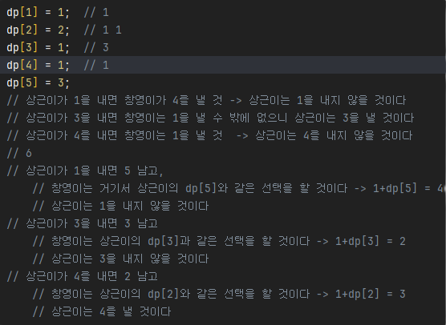

## 📅 Mar

**2025.03.01 토요일**

<details>
<summary>BOJ1325. 효율적인 해킹</summary>

[코드](BOJ1325_효율적인해킹.java)
> **_BFS_**
>
> - 아이디어 :  
>   해당 숫자에서 시작했을 때 해킹할 수 있는 컴퓨터의 수를 bfs로 세어주자!
> - 느낀 점 :
>   - bfs dfs 개념은 아는데 여전히 구현할 때마다 생각이 정리가 잘 안 된다. 연습 많이 해야지
>   - 반례 사이트 없이 디버깅할 수 있을 만큼 되고 싶다
> - 메모 :
>   - arr[i]에 담긴 배열이 비어있을 경우 처리 안 해줘서 틀림.
>   - return 값이 같은 게 나오면 result pq에 추가하게 했으므로, pq에 여러개가 담긴 상황이 있을 수 있음. 그 상태에서 더 큰 return 나오면 clear로 아예 비우고 걔로 넣어줘야 하는데 pop만 해줘서 틀림.

```
package workingon;

import java.io._;
import java.util._;

public class BOJ1325\_효율적인해킹 {
static ArrayList<Integer>[] arr;
static boolean[] visited;
static Queue<Integer> queue = new LinkedList<>();

    public static void main(String[] args) throws IOException {
        BufferedReader br = new BufferedReader(new InputStreamReader(System.in));
        StringTokenizer st = new StringTokenizer(br.readLine());
        int N = Integer.parseInt(st.nextToken());
        int M = Integer.parseInt(st.nextToken());
        arr = new ArrayList[N+1];

        for (int i = 1; i <= N; i++) {
            arr[i] = new ArrayList<>();
        }

        for (int i = 0; i < M; i++) {
            st = new StringTokenizer(br.readLine());
            int A = Integer.parseInt(st.nextToken());
            int B = Integer.parseInt(st.nextToken());

            arr[B].add(A);
        }

// System.out.println(Arrays.toString(arr));
int cnt = 0;
int max = 0;
PriorityQueue<Integer> pq = new PriorityQueue<>();
for(int i = 1 ; i <= N ; i++) {
// System.out.println("i = " + i + "일 때");
visited = new boolean[N+1];
if(!arr[i].isEmpty()) {
int res = bfs(i);
if (res > max) {
pq.clear();
pq.offer(i);
max = res;
// System.out.println("PQ : " + pq);
} else if (max == res) {
pq.offer(i);
// System.out.println("PQ : " + pq);
}
}
}

        while(!pq.isEmpty()) {
            System.out.print(pq.poll()+" ");
        }


    }

    public static int bfs(int start){
        queue.offer(start);
        visited[start] = true;
        int cnt = 0;

        while(!queue.isEmpty()) {

// System.out.println("현재 큐 : " + queue);
int cur = queue.poll();
cnt++;
for(int i = 0 ; i < arr[cur].size() ; i++) {
if(!visited[arr[cur].get(i)]) {
queue.offer(arr[cur].get(i));
F visited[arr[cur].get(i)] = true;
}
}
}

// System.out.println("cnt : " + cnt);
return cnt;
}
}
```
</details>

<details>
<summary>BOJ2164. 카드2</summary>

[코드](BOJ2164_카드2.java)
> **_Queue_**
>
> - 너무 쉬웠다...보자마자 queue 떠올리고 코드 쓰는 것까지 3분컷 함. 

```
package groupstudy.algorithm_study;

import java.util.LinkedList;
import java.util.Queue;
import java.util.Scanner;

public class BOJ2164_카드2 {
    /**
     * 카드2
     * <a href="https://www.acmicpc.net/problem/2164">...</a>
     */

    public static void main(String[] args) {
        Scanner sc = new Scanner(System.in);
        int n = sc.nextInt();
        Queue<Integer> queue = new LinkedList<>();
        for(int i = 1 ; i <= n ; i++){
            queue.offer(i);
        }
        while(queue.size() > 1){
            int remove = queue.poll();
            int move = queue.poll();
            queue.offer(move);
        }

        System.out.println(queue.poll());
    }
}

```
</details>

<details>
<summary>BOJ1181. 단어 정렬</summary>

[코드](../../BOJ/BOJ1181_단어정렬.java)
> 이것도 보자마자 pq 써야지 하고 Comparator 만들어서 풀었음. 한...10분컷 한 듯?

```
package BOJ;

import java.io.BufferedReader;
import java.io.IOException;
import java.io.InputStreamReader;
import java.util.Comparator;
import java.util.PriorityQueue;

public class BOJ1181_단어정렬 {
    /**
     * 단어 정렬
     * <a href="https://www.acmicpc.net/problem/1181">...</a>
     */
    public static void main(String[] args) throws IOException {
        BufferedReader br = new BufferedReader(new InputStreamReader(System.in));
        int N = Integer.parseInt(br.readLine());
        PriorityQueue<String> pq = new PriorityQueue<>(new Comparator<String>() {
            @Override
            public int compare(String o1, String o2) {
                if(o1.length() != o2.length())
                    return o1.length()-o2.length();
                else
                    return o1.compareTo(o2);
            }
        });

        for(int i = 0 ; i < N ; i++) {
            String word = br.readLine();
            if(!pq.contains(word))
                pq.offer(word);
        }

        while(!pq.isEmpty()) {
            System.out.println(pq.poll());
        }
    }
}

```
</details>

<details>
<summary>BOJ2920. 음계</summary>

[코드1](../../BOJ/BOJ2920_음계_1.java)
[코드2](../../BOJ/BOJ2920_음계_2.java)
> - 처음에 엄청 야매로 풀었다... ㅋㅋ 1부터 8까지가 한 번씩 등장한다길래 그냥 String으로 바꿔서 비교해줌  
> - 너무 야매로 푼 게 양심에 찔려서 flag 쓴 정석 방법으로도 다시 풀었다
> - 난이도는 쉬웠음. flag 쓸 때 약간 오래 생각하긴 했지만? 그래도 20분 안에 끝냄

```
// String 값 비교
import java.util.Scanner;

public class BOJ.BOJ2338_긴자리계산 {
    public static void main(String[] args) {
        Scanner sc = new Scanner(System.in);
        StringBuilder sb = new StringBuilder();
        for(int i= 0 ;i < 8 ; i++)
            sb.append(sc.next());

        if(String.valueOf(sb).equals("12345678"))
            System.out.println("ascending");
        else if(String.valueOf(sb).equals("87654321"))
            System.out.println("descending");
        else
            System.out.println("mixed");
    }
}
```
```

import java.util.Scanner;

public class BOJ.BOJ2338_긴자리계산 {
    public static void main(String[] args) {
        Scanner sc = new Scanner(System.in);
        int[] arr = new int[8];
        for (int i = 0; i < 8; i++) {
            arr[i] = sc.nextInt();
        }

        boolean flag = true;
        for (int i = 0; i < 8 - 1; i++) {
            if(arr[i] < arr[i+1]) {
                if(!flag) {
                    System.out.println("mixed");
                    return;
                }
                flag = true;
            } else if(arr[i] > arr[i+1]){
                if(i != 0 && flag){
                    System.out.println("mixed");
                    return;
                }
                flag = false;
            }
        }
        if(flag) {
            System.out.println("ascending");
        } else {
            System.out.println("descending");
        }
    }
}

```

</details>

<details>
<summary>BOJ10250. ACM 호텔</summary>

[코드](../../BOJ/BOJ10250_ACM호텔.java)
> - 이런 문제 있을 때마다 나머지 있는 경우랑 없는 경우랑 나눠서 계산해주는 게 깔끔하지 못한 것 같아서 GPT에 물어봄
> - 출력 포맷 일케 설정하면 됨 ! => floor + String.format("%02d", dis);
> - dis = (N - 1) / H + 1 로 계산하면 됨

```
package BOJ;

import java.util.*;

public class BOJ10250_ACM호텔 {
    public static void main(String[] args) {
        Scanner sc = new Scanner(System.in);

        int T = sc.nextInt();

        for (int Main = 1; Main <= T; Main++) {
            int H = sc.nextInt();
            int W = sc.nextInt();
            int N = sc.nextInt();

            int dis;
            int floor;
            if (N % H == 0) {
                dis = N / H;
                floor = H;
            } else {
                dis = N / H + 1;
                floor = N % H;
            }

            if (dis >= 10)
                System.out.println(floor + "" + dis);
            else
                System.out.println(floor + "0" + dis);
        }

    }

}

```
</details>

<details>
<summary>BOJ1676. 팩토리얼 0의 개수</summary>

[코드](../APS/groupstudy/algorithm_study/BOJ1676_팩토리얼0의개수.java)
> - 아이디어 :  
>   - 0이 생기는 경우는 2와 5가 페어됐을 때 !  
>   - 근데 5까지 가면 페어될 2는 앞에 있을 수밖에 없음
>   - 따라서, 5의 개수가 중요하다!
> - 느낀 점 :
>   - 생각했던 것과 자꾸 다르게 나와서 어려웠다
> - 메모 :
>   - 5의 제곱수들은 5를 여러 번 포함하고 있다는 사실을 간과함

```
package BOJ;

import java.util.Scanner;

public class BOJ1676_팩토리얼0의개수 {
    public static void main(String[] args) {
        Scanner sc = new Scanner(System.in);
        int n = sc.nextInt();

        int cnt = 0;
        for(int i = 5 ; i <= n ; i*=5 ) {
            cnt += n/i;
        }
        System.out.println(cnt);
    }
}
```

</details>

<details>
<summary>BOJ10989. 수 정렬하기3</summary>

[코드](../../BOJ/BOJ10989_수정렬하기3.java)
> - 아이디어 : 
>   - 그냥 pq 쓸까... -> 시간초과
>   - 그렇다면 LinkedList 쓰고 정렬... -> 메모리 초과
>   - 직접 정렬해주는 수밖에 없었음. 카운팅 정렬 사용.
> - 느낀 점 :
>   - 템플릿에만 의존하면 안 된다! 카운팅 정렬 시험 공부할 때 기억해둔 거 그대로 쓰려고 했는데,  
>   저만한 크기의 배열을 두 개 만드는 것도 메모리 낭비고...바로바로 StringBuilder에 저장해주면 되는 거였음
>   arr에 인덱스로 자리 찾아서 저장할 게 아니므로 누적합으로 구할 필요도 없음.

```
package BOJ;

import java.io.*;
import java.util.Arrays;

public class BOJ10989_수정렬하기3 {
    public static void main(String[] args) throws IOException {
        BufferedReader br = new BufferedReader(new InputStreamReader(System.in));
        StringBuilder sb = new StringBuilder();
        int n = Integer.parseInt(br.readLine());
        int[] cnt = new int[10001];
        for(int i = 0 ; i < n ; i++) {
            cnt[Integer.parseInt(br.readLine())] ++;
        }

        for(int i = 0 ; i < 10001 ; i++) {
            while(cnt[i] > 0){
                sb.append(i).append("\n");
                cnt[i]--;
            }
        }

        System.out.println(sb);

    }
}

```

</details>

<br>

**2025.03.03 월요일**

<details>
<summary>SWEA2382. 미생물 격리</summary>

[코드](../../SWEA/SWEA2382_미생물격리.java)
> - 아이디어 : 
>   - 군집들은 클래스로 만들어서 관리해야겠다
>   한 시간 지날 때 해야하는 것
>   - 있던 곳을 비워준다
>   - 방향대로 이동한다  
>   / next의 행이나 열이 0이면 미생물 수 /= 2  
	/ next가 null인지 보고 (이미 미생물 군집이 있는지 보고)  
		// null이 아니면 ->   
			미생물 수 비교해서 큰 애 방향으로 설정  
			미생물 수 더해서 저장해주기
>
> - 느낀 점 :  
>   문제를 보고 해야하는 일들을 단계로 나눠서 정리하는 능력이 좀 는 게 느껴진다
>
> - 메모 :
>   - 동시에 같은 칸으로 가려는 경우를 처리해줄 때 나는 아예 sort() 해서 처리하기 편한 순서대로 집어넣어줬는데, HashMap<String, ArrayList<Microbiome>>으로 기록하는 방법도 있었다.
>   - 아래 구문을 삭제하면 답이 틀리게 나오길래 고민했는데 sort() 정렬해주는 위치 때문이었다! 처음에 약품구역 들어가서 num 반으로 깎고 나서 정렬해줬어야 했는데 list에 값을 넣을 때 정렬해줘서 이상한 거였음. 순서 바꿔주고 나니까 밑에 구문 지워도 잘 나온다. 첨에 아마 매번 정렬하느라 시간복잡도도 컸을 듯.  
>   ```
>   else {    // 새로 들어가려는 애가 더 커
>   cur.num += map[cur.nextR][cur.nextC].num;
>   map[cur.nextR][cur.nextC].num = 0;
>   map[cur.nextR][cur.nextC] = cur;
>   cur.r = cur.nextR;
>   cur.c = cur.nextC;
>   }
>   ```

```
package SWEA;

import java.io.*;
import java.util.ArrayList;
import java.util.Collections;
import java.util.Comparator;
import java.util.List;

public class SWEA2382_미생물격리 {

    public static void main(String[] args) throws IOException {
        BufferedReader br = new BufferedReader(new InputStreamReader(System.in));
        int T = Integer.parseInt(br.readLine());
        String[] str;
        for (int Main = 1; Main <= T; Main++) {
            str = br.readLine().split(" ");
            int N = Integer.parseInt(str[0]);   // map 크기
            int M = Integer.parseInt(str[1]);   // 격리 시간
            int K = Integer.parseInt(str[2]);   // 미생물 군집의 개수
            List<Microbiome> list = new ArrayList<>();  // 미생물 군집 정보 관리
            Microbiome[][] map = new Microbiome[N][N];

            // 최초 미생물 군집 정보 등록
            for (int i = 0; i < K; i++) {
                str = br.readLine().split(" ");
                int r = Integer.parseInt(str[0]);
                int c = Integer.parseInt(str[1]);
                int num = Integer.parseInt(str[2]);
                int dir = Integer.parseInt(str[3]); // 1 상, 2 하, 3 좌, 4 우

                Microbiome m = new Microbiome(r, c, num, dir);
                list.add(m);
                map[r][c] = m;
            }

            while (M-- > 0) {


                for (int i = 0; i < list.size(); i++) {
                    Microbiome cur = list.get(i);

                    switch (cur.dir) {
                        case 1:
                            cur.nextR--;
                            break;
                        case 2:
                            cur.nextR++;
                            break;
                        case 3:
                            cur.nextC--;
                            break;
                        case 4:
                            cur.nextC++;
                            break;
                    }

                    // 테두리에 도착하면
                    if (cur.nextR == 0 || cur.nextC == 0 || cur.nextR == N - 1 || cur.nextC == N - 1) {
                        cur.num /= 2; // 미생물 수 반으로 깎아주고
                        // 방향 반대로 바꿔주기
                        if (cur.dir == 1 || cur.dir == 3) cur.dir++;
                        else cur.dir--;
                    }
                }
                Collections.sort(list, Comparator.reverseOrder());

                map = new Microbiome[N][N];
                for (int i = 0; i < list.size(); i++) {
                    Microbiome cur = list.get(i);
                    if (map[cur.nextR][cur.nextC] == null) {
                        map[cur.nextR][cur.nextC] = cur;
                        cur.r = cur.nextR;
                        cur.c = cur.nextC;
                    } else {
                        if (map[cur.nextR][cur.nextC].num > cur.num) {  // 이미 있는 애가 더 커
                            map[cur.nextR][cur.nextC].num += cur.num;
                            cur.num = 0;
                        }
                    }
                }
            }

            int res = 0;
            for (int i = 0; i < list.size(); i++) {
                res += list.get(i).num;
            }
            System.out.printf("#%d " + res + "\n", Main);
        }
    }

    public static class Microbiome implements Comparable<Microbiome> {
        int r;
        int c;
        int nextR;
        int nextC;
        int num;
        int dir;

        public Microbiome(int r, int c, int num, int dir) {
            this.r = r;
            this.c = c;
            this.num = num;
            this.dir = dir;
            this.nextR = r;
            this.nextC = c;
        }

        @Override
        public String toString() {
            return num + "(" + dir + ")";
        }

        @Override
        public int compareTo(Microbiome o) {
            return this.num - o.num;
        }
    }
}

```

</details>

<details>
<summary>BOJ13023. ABCDE</summary>

[코드](../../BOJ/BOJ13023_ABCDE.java)
> - 아이디어 :
>   - DFS로 내려가면서 최대로 어디까지 내려갈 수 있는지 체크. 5명 이상 내려갈 수 있으면 1 출력
> - 느낀점 :
>   - 처음에는 모든 친구가 다 A-B-C-D-E 관계여야 한단는 건가? 했는데, 알고 보니 그런 관계인 사람이 5명 이상 있으면 되는 거였음
> - 메모 :
>   - 기본 DFS 양식으로 쓰되, 단계 카운팅하는 게 관건이었다. depth 만 return 해서 쓰자니 자꾸 꼬이길래 maxDepth 만들어서 최대깊이 저장해줬다.
>   - dfs 재귀 돌리고 나서 visited[friend]를 초기화 안 해줬더니, 더 나은 루트가 있음에도 백트래킹이 안 되는 문제 발생.  
>   방금 보고 나온 친구 초기화 해줘야 maxDepth 5명 안 됐을 때 다른 루트도 탐색해볼 수 있음

```
package BOJ;

import java.io.*;
import java.util.*;

public class BOJ13023_ABCDE {
    /**
     * ABCDE
     * <a href="https://www.acmicpc.net/problem/13023">...</a>
     */

    static HashMap<Integer, ArrayList<Integer>> hashmap;
    static boolean[] visited;
    static Stack<Integer> stack = new Stack<>();
    static int maxDepth;

    public static void main(String[] args) throws IOException {
        BufferedReader br = new BufferedReader(new InputStreamReader(System.in));
        String[] input = br.readLine().split(" ");
        int N = Integer.parseInt(input[0]);   // 사람 수
        int M = Integer.parseInt(input[1]);   // 친구 관계(간선) 수
        hashmap = new HashMap<>();
        for (int i = 0; i < M; i++) {
            input = br.readLine().split(" ");
            int a = Integer.parseInt(input[0]);
            int b = Integer.parseInt(input[1]);

            if (!hashmap.containsKey(a))
                hashmap.put(a, new ArrayList<>());
            hashmap.get(a).add(b);

            if (!hashmap.containsKey(b))
                hashmap.put(b, new ArrayList<>());
            hashmap.get(b).add(a);
        }

        /// 관계 설정 끝

        for (int p : hashmap.keySet()) {
            visited = new boolean[N];
            maxDepth = 1;
            dfs(p, 1);
            if (maxDepth >= 5) {
                System.out.println(1);
                return;
            }
        }
        System.out.println(0);


    }

    public static void dfs(int cur, int depth) {
        maxDepth = Math.max(maxDepth, depth);

        if(maxDepth >= 5) {
            return;
        }

        stack.add(cur);
        visited[cur] = true;

        for (int friend : hashmap.get(stack.pop())) {
            if (!visited[friend]) {
                dfs(friend, depth + 1);
                visited[friend] = false;
            }
        }
    }
}

```

</details>

<details>
<summary>BOJ2751. 수 정렬하기 2</summary>

[코드](../../APS/BOJ/BOJ2752_수정렬하기2_2.java)
> - 느낀점 :  
> 	실버길래 이렇게 쉬울 순 없다는 생각에 오히려 꼬아서 생각한 듯.  
> 	그냥 Arrays.sort() 써도 되는 문제였다. 허무해...  
> 	시간초과는 로직이 아니라 BufferedReader랑 StringBuilder 써서 해결해야 하는 문제였어
> - 메모 :
>   - '이 수는 절댓값이 1,000,000보다 작거나 같은 정수이다' << 이 조건 간과하고 양수만 처리해서 틀림
>   - 심지어 수는 중복되지 않는다는 조건도 있다...이게 왜 실버?;;

```
package BOJ;

import java.io.BufferedReader;
import java.io.IOException;
import java.io.InputStreamReader;
import java.util.Arrays;

public class BOJ2751_수정렬하기2_2 {
    /** 수 정렬하기 2
     * <a href="https://www.acmicpc.net/problem/2751">...</a>
     */
    public static void main(String[] args) throws IOException {
        BufferedReader br = new BufferedReader(new InputStreamReader(System.in));
        StringBuilder sb = new StringBuilder();
        int N = Integer.parseInt(br.readLine());
        int[] arr = new int[N];
        for(int i = 0 ; i < N ; i++) {
            int num = Integer.parseInt(br.readLine());
            arr[i] = num;
        }
        Arrays.sort(arr);

        for(int i = 0 ; i < N ; i++) {
            sb.append(arr[i] + "\n");
        }

        System.out.println(sb);
    }
}

```
</details>

<br>

**2025.03.04 화요일**

<details>
<summary>알고리즘 월말평가 - 지은이의 전화 걸기</summary>

[코드](../../../../ssafy/시험/0304%20월말평가/Algo_서울_09_이언지/src/Test1_서울_09_이언지.java)
> - 느낀 점 :
>   - 쉬웠다...근데 오히려 너무 쉬워서 내가 너무 단순하게 풀었나 의심됐어

```
import java.util.*;


public class Test1_서울_09_이언지 {
	public static void main(String[] args) {
		Scanner sc = new Scanner(System.in);
		int T = sc.nextInt();
		for(int Main = 1 ; Main <= T ; Main++) {
			
			String str = sc.next();
			
			// 입력 받은 문자열을 한 글자씩 쪼개서 배열에 담아준다
			char[] arr = str.toCharArray();
			int res = 0;	// 다이얼 돌릴 때마다 걸린 시간 더해줄 결과 변수
			
			// char 배열을 훑으면서 글자에 해당하는 값을 res에 더해준다
			for(int i = 0 ; i < arr.length ; i++) {
				if(arr[i] >= 'A' && arr[i] <= 'C') {
					res += 3;
				} else if (arr[i] >= 'D' && arr[i] <= 'F') {
					res += 4;
				} else if (arr[i] >= 'G' && arr[i] <= 'I') {
					res += 5;
				} else if (arr[i] >= 'J' && arr[i] <= 'L') {
					res += 6;
				} else if (arr[i] >= 'M' && arr[i] <= 'O') {
					res += 7;
				} else if (arr[i] >= 'P' && arr[i] <= 'S') {
					res += 8;
				} else if (arr[i] >= 'T' && arr[i] <= 'V') {
					res += 9;
				} else if (arr[i] >= 'W' && arr[i] <= 'Z') {
					res += 10;
				}
			}
			
			// 양식에 맞춰서 출력
			System.out.printf("#%d %d\n", Main, res);
		}
	}

}

```
</details>

<details>
<summary>알고리즘 월말평가 - 괄호 짝짓기 완성 (실패) </summary>

[코드](../../../../ssafy/시험/0304%20월말평가/Algo_서울_09_이언지/src/Test2_서울_09_이언지.java)
> - 아이디어 :
>   - 괄호는...스택이지
> - 느낀 점 :
>   - 1했다 생각했는데 마지막에 0 붙는 경우가 있었어...  
>   stack에서 꺼낼 애가 hashmap의 key로 포함하지 않는 문자라면 닫는 괄호인데 짝은 없는 애니까 맞추기 불가능!' 이 부분에서  
>   닫는 괄호를 pop 하고 문자열 붙여줬어야 했는데 pop 안 해줘서 닫는 괄호랑 같이 나옴

```
// 수정한 버전
import java.util.*;

public class Test2_서울_09_이언지 {
	public static void main(String[] args) {
		Scanner sc = new Scanner(System.in);
		
		int T = sc.nextInt();
		for(int Main = 1 ; Main <= T ; Main++) {
			StringBuilder sb = new StringBuilder();
			Stack<Character> stack = new Stack<>();
			String str = sc.next();
			sb.append("#").append(Main).append(" "); // 테스트케이스마다 공통으로 출력돼야하는 양식

			
			// HashMap에 쌍 묶어서 관리해줄 것
			HashMap<Character, Character> hashmap = new HashMap<>();
			hashmap.put('(', ')');
			hashmap.put('{', '}');
			hashmap.put('[', ']');
			hashmap.put('<', '>');
			
			// 이 반복문 돌고 나면 이미 짝 맞는 애들은 다 지워지고 안 맞는 애들만 남음
			for(int i = 0 ;i < str.length() ; i++) {
				// stack이 비어있으면 무조건 넣어주고
				if(stack.isEmpty()) {
					stack.push(str.charAt(i));
				}
				
				// 만약 내가 여는 애면 그냥 넣어줘
				else if(hashmap.containsKey(str.charAt(i))) {
					stack.push(str.charAt(i));
				}
				
				// 만약 내가 닫는 애고, 짝이 맞는 애를 만나면 지워줘
				else if (hashmap.containsKey(stack.peek()) && str.charAt(i) == hashmap.get(stack.peek())) {
					stack.pop();
				}
			}
			
//			System.out.println(stack);
		
			// 만약 스택이 비었으면 이미 짝 다 맞는 애들
			if(stack.isEmpty()) {
				sb.append("1");
				System.out.println(sb);
				continue;
			}
			
			// 이제 짝 맞춰줄 거야
			while(!stack.isEmpty()) {

				char top = stack.peek();

				// 만약 stack에서 꺼낼 애가 여는 괄호라면 짝 맞는 닫는 괄호 붙여줘
				if(hashmap.containsKey(top)) {
					sb.append(hashmap.get(top));
					stack.pop();
				}

				// 만약 stack에서 꺼낼 애가 hashmap의 key로 포함하지 않는 문자라면
				// 닫는 괄호인데 짝은 없는 애니까 맞추기 불가능!
				else {
					stack.pop();
					sb.append("0");
					break;
				}
			}

			System.out.println(sb);
		}	// testcase
	}
}

```
</details>

<details>
<summary>알고리즘 월말평가 - 수영장 물결</summary>

[코드](../../../../ssafy/시험/0304%20월말평가/Algo_서울_09_이언지/src/Test3_서울_09_이언지.java)
> - 아이디어 :
>   - 좌표마다 그냥 함수로 델타 탐색 빼서 돌린 담에 최댓값 찾고, 그 좌표마다의 최댓값 중 최댓값을 구해주면 되곘다.
> - 느낀 점 :
>   - 쉽다고 느끼긴 했는데 정답 맞았을지는 모르겠다.

```
import java.util.Scanner;

public class Test3_서울_09_이언지 {

	static int[][] board;

	public static void main(String[] args) {
		Scanner sc = new Scanner(System.in);

		int T = sc.nextInt();

		for (int Main = 1; Main <= T; Main++) {
			int N = sc.nextInt();
			board = new int[N][N];

			// 초기 에너지값 담아주기
			for (int i = 0; i < N; i++) {
				for (int j = 0; j < N; j++) {
					board[i][j] = sc.nextInt();
				}
			}

			long res = 0;

			for (int i = 0; i < N; i++) {
				for (int j = 0; j < N; j++) {
					// 현재 위치에서 A 썼을 때, B 썼을 때, C 썼을 때 중 가장 큰 값 cnt에 담아주고
					long cnt = Math.max(board[i][j], Math.max(b(i, j), c(i, j)));
					// 전체 위치에서 가장 큰 값 res에 담아줌
					res = Math.max(cnt, res);
				}
			}

			System.out.printf("#%d %d\n", Main, res);
		}
	}

	// B 장풍 쏜 경우
	public static int b(int i, int j) {
		// 현재 위치에서 B 장풍 썼을 때 결과 담아줄 변수
		int cnt = 0;

		// 방향 설정해줄 델타값
		int[] dx = { -1, -1, 0, 1, 1, 1, 0, -1 };
		int[] dy = { 0, 1, 1, 1, 0, -1, -1, -1 };

		// 델타값 돌면서 결과 더해주기
		for (int d = 0; d < 8; d++) {
			int nx = dx[d] + i;
			int ny = dy[d] + j;

			if (nx >= 0 && ny >= 0 && nx < board.length && ny < board.length) {
				cnt += board[nx][ny];
			}
		}
		
		return cnt;
	}
	
	public static long c(int i, int j) {
		// 현재 위치에서 C 장풍 썼을 때 결과 담아줄 변수
		long cnt = 0;

		// 방향 설정해줄 델타값
		int[] dx = { -2, -2, -2, -2, -2, -1, 0, 1, 2, 2, 2, 2, 2, 1, 0, -1};
		int[] dy = { -2, -1, 0, 1, 2, 2, 2, 2, 2, 1, 0, -1, -2, -2, -2, -2};

		// 델타값 돌면서 결과 더해주기
		for (int d = 0; d < 16; d++) {
			int nx = dx[d] + i;
			int ny = dy[d] + j;

			if (nx >= 0 && ny >= 0 && nx < board.length && ny < board.length) {
				cnt += board[nx][ny];
			}
		}
		
		return cnt;
	}

}

```
</details>

<details>
<summary>SW역량평가 A형 나무의 키 (실패)</summary>

[코드](../../../../ssafy/시험/0304%20SW역량평가/Tree.java)
> - 아이디어 :
>   - 한놈씩 팬다...하나를 1 2 1 2 이렇게 계속 키워주다가 3 미만으로 남으면 다음 애로 넘어감
>   - 한 바퀴 돌고 나서 남은 애들 보면서 1이랑 2 짝지을 수 있으면 또 이틀 써서 짝지어주기
>   - 남은 애들 짝짓기까지 끝냈으면, 목표치까지 1 남은 애들 or 2 남은 애들만 남아있을 것
>   - 1 남은 애들만 남았으면, *2 해주고 첫날 하루 -1 해줌  
>   2 남은 애들만 남았으면, *2 해줌
> - 느낀점 :
>   - 테케 다 맞아서 혹시나 했는데 역시나. 반례 듣고 나서 뒤통수 맞은 기분이었다.....A형의 벽은 높구나ㅜ
> - 메모 : 
>     - 마의 1 4 4 5 를 통과하지 못함 ㅎㅎ 1 4 4 5 인 경우 [2] [0] [1] [0] 이렇게 4일 주면 되는데, 내 로직으로는 7일 나온다.

```
import java.util.*;

public class Tree {
	public static void main(String[] args) {
		Scanner sc = new Scanner(System.in);

		int T = sc.nextInt();
		for (int Main = 1; Main <= T; Main++) {
			int n = sc.nextInt();
			int max = 0;
			int[] arr = new int[n];
			for (int i = 0; i < n; i++) {
				arr[i] = sc.nextInt();
				max = Math.max(max, arr[i]);
			}

			for (int i = 0; i < n; i++) {
				arr[i] = max - arr[i];
			}

			int sum = 0;
			for (int i = 0; i < n; i++) {
				sum += arr[i] / 3 * 2;
				arr[i] = arr[i] % 3;
			}

			Arrays.sort(arr);
			int cnt1 = 0;
			int cnt2 = 0;

			for (int i = 0; i < arr.length; i++) {
				if (arr[i] == 1)
					cnt1++;
				else if (arr[i] == 2)
					cnt2++;
			}

			int mutual = Math.min(cnt1, cnt2);
			sum += mutual * 2;

			int start1 = -1;
			for (int i = 0; i < n; i++) {
				if (arr[i] == 1) {
					start1 = i;
					break;
				}
			}

			for (int i = 0; i < mutual; i++) {
				arr[start1 + i] = 0;
				cnt1--;
				arr[arr.length - 1 - i] = 0;
				cnt2--;
			}

			if (cnt2 == 0 && cnt1 > 0) {
				sum += cnt1 * 2-1;
			} else if (cnt1 == 0 && cnt2 > 0) {
				sum += 4 * (cnt2 / 3);
				cnt2 = cnt2 % 3;
				
				if (cnt2 == 1) {
					sum += 2;
				} else if (cnt2 == 2) {
					sum += 3;
				}
			}

			System.out.printf("#%d %d\n", Main, sum);

		}
	}
}

```

</details>

<br>

**2025.03.05 수요일**

<details>
<summary>BOJ25918. 북극곰은 괄호를 찢어 (시간초과) </summary>

[코드1](../APS/workingon/BOJ25918_북극곰은괄호를찢어_시간초과.java)
[코드2](../APS/workingon/BOJ25918_북극곰은괄호를찢어_시간초과2.java)
> - 아이디어
>   - 처음에는 O나 X 찾을 때마다 문자열에서 replace로 삭제해주고, 문자열이 비거나 바꿀 게 없으면 끝내주는 방식 생각함 -> 시간초과
> 	- stack에 넣어주면서 O나 X 발견하면 처리해주고, 남은 애들로 다시 돌리면서 days 카운트 해주는 방식 -> 시간초과
> - 느낀점
>   - 내 방식대로는 O(N^2)! 최대 20만일 때 N^2 되면 400억. O(N)에 처리해줄 방법을 찾아야 한다.
>   - 결국 GPT에 물어봤기 때문에 일단 안 풀고 내버려뒀다. 나중에 까먹을 때쯤 다시 풀어봐야지.
> - 메모
>   - 문자열 replace는 원본 문자열을 바꾸는 게 아니라서, 바꾼 문자열을 저장할 거면 다시 변수에 할당해줘야 한다.

```
package workingon;

import java.io.BufferedReader;
import java.io.IOException;
import java.io.InputStreamReader;
import java.util.Stack;

public class BOJ25918_북극곰은괄호를찢어_시간초과2 {
    public static void main(String[] args) throws IOException {
        BufferedReader br = new BufferedReader(new InputStreamReader(System.in));
        StringBuilder sb;
        int N = Integer.parseInt(br.readLine());
        String S = br.readLine();
        int days = 0;
        boolean flag = true;
        Stack<Character> stack = new Stack<>();

        while(flag) {
            days++;
            flag = false;
            for (int i = 0; i < S.length(); i++) {
                char cur = S.charAt(i);
                if (stack.isEmpty()) {
                    stack.push(cur);
                } else {
                    char before = stack.peek();

                    if ((before == '(' && cur == ')') || (before == ')' && cur == '(')) {
                        stack.pop();
                        stack.push('O');
//                        System.out.println(before + "랑 " + cur + "랑 만나서 사라짐");
                        flag = true;
                    } else {
                        stack.push(cur);
//                        System.out.println(stack);
                    }
                }
            }   // 이거 돌고 나오면 이번 회차에 짝 맞는 애들 O로 바꿔서 stack 넣어줬어

            sb = new StringBuilder();
            while(!stack.isEmpty()) {
                char cur = stack.pop();
                if(cur != 'O'){
                    sb.append(cur);
                }
            }

            S = sb.toString();

            if(S.isEmpty())
                break;
        }

        if(stack.isEmpty())
            System.out.println(days);
        else
            System.out.println(-1);

    }   // main
}   // class


```
</details>

<details>
<summary>BOJ2999. 비밀 이메일</summary>

[코드](../study/APS/BOJ/BOJ2999_비밀이메일.java)
> - 아이디어 :
>   1. N의 약수들 중에 두 개를 R과 C로 골라
>   2. 입력을 세로로 받아적은 다음
>	3. 가로로 읽으면 정답
> - 느낀점 : 
> 	- 처음에 주어진 암호 만드는 방법대로 하라는 게 아니라, 그렇게 만들어진 암호를 해독하라는 게 미션이었음
>   - 막 어렵진 않은데 배열에 세로로 넣어주는 부분에서 살짝 헷갈렸다.
>   - N이 작아서 이건 약수 다 구해줘도 괜찮았는데, N이 커지면 시간복잡도 터질 것 같다. 루트 해서 가까운 약수로 해줘야 하나.

```
package BOJ;

import java.util.ArrayList;
import java.util.List;
import java.util.Scanner;

public class BOJ2999_비밀이메일 {
    public static void main(String[] args) {
        // N의 약수들 중에 두 개를 R과 C로 골라
        // 입력을 세로로 받아적은 다음
        // 가로로 읽으면 정답

        Scanner sc = new Scanner(System.in);
        String str = sc.next();
        int N = str.length();

        // 일단 R이랑 C 골라줄게
        // 약수들 담아줄 리스트
        // 최대 100글자니까 그냥 돌려줘도 될 것 같은데?
        List<Integer> list = new ArrayList<>();
        for (int i = 1; i <= N; i++) {
            if (N % i == 0) list.add(i);
        }

//        System.out.println(list);

        int R = 0;
        if (list.size() % 2 == 0) {
            R = list.get(list.size() / 2 - 1);
        } else {
            R = list.get((list.size() + 1) / 2 - 1);
        }
        int C = N / R;

//        System.out.println(N);
//        System.out.println(R + " " + C);


        // 이제 세로로 받아적을 거야
        char[][] map = new char[R][C];
        StringBuilder sb = new StringBuilder();
        int idx = 0;
        for (int j = 0; j < C; j++) {
            for (int i = 0; i < R; i++) {
                map[i][j] = str.charAt(idx);
                idx++;
            }
        }

        for (int i = 0; i < R; i++) {
            for (int j = 0; j < C; j++) {
                sb.append(map[i][j]);
            }
        }

        System.out.println(sb);
    }
}

```

</details>

<details>
<summary>SWEA4012. 요리사</summary>

[코드](../../SWEA/SWEA4012_요리사.java)
> - 아이디어 :
>   1. 재료 조합을 짜고    ex) [식재료1, 식재료2], [식재료3, 식재료4]
>   2. 짠 조합 안에서 맛 총합 구하고 차이 구해줘. 최소 차이값 갱신.  
>   for(int i = 0 ; i < N/2 ; i++)  
>   for(int j = 0 ; j < N/2; j++)  
>      sum1 += map[com1[i]][com1[j]];  
>      sum2 += map[com2[i]][com2[j]];  
>      int diff = Math.abs(sum1 - sum2);  
>      min = Math.min(min, diff);
>   3. 더 이상 새로운 조합이 없으면 min 출력
> - 느낀점 :
>   - 재귀 어려워 ㅜ
>   - 이거 N 커지면 시간복잡도 엄청 클 것 같은데...

```
package SWEA;

import java.util.*;

public class SWEA4012_요리사 {
    /**
     * 요리사
     * <a href="https://swexpertacademy.com/main/code/problem/problemDetail.do?contestProbId=AWIeUtVakTMDFAVH">...</a>
     */

    static int[][] board;
    static boolean[] vis;
    static int N;   // 식재료 개수
    static int min;
    static List<Integer> combi1;
    static List<Integer> combi2;

    public static void main(String[] args) {
        Scanner sc = new Scanner(System.in);
        int T = sc.nextInt();
        for (int Main = 1; Main <= T; Main++) {
            N = sc.nextInt();
            board = new int[N][N];
            vis = new boolean[N];
            combi1 = new ArrayList<>();
            combi2 = new ArrayList<>();
            min = Integer.MAX_VALUE;

            for (int i = 0; i < N; i++) {
                for (int j = 0; j < N; j++) {
                    board[i][j] = sc.nextInt();
                }
            }   /// 여기까지 입력받기

            for (int i = 0; i < N / 2; i++) {
                combi1.add(0);
            }

            combi(0, 0);
            System.out.printf("#%d %d\n", Main, min);
        }   // testCase 끝
    }   // main 끝

    // 일단 식재료 뭐뭐 고를지부터 정하자
    public static void combi(int sidx, int idx) {
        if (sidx == N / 2) {
            // combi2 만들어줘
            combi2.clear();
            for(int i = 0 ; i < N ; i++) {
                combi2.add(i);
            }
            combi2.removeAll(combi1);

//            System.out.println(combi1);
//            System.out.println(combi2);

            int sum1 = 0;
            int sum2 = 0;
            for(int i = 0 ; i < N/2 ; i++) {
                for(int j = 0 ; j < N/2; j++) {
                    if(i != j) {
                        sum1 += board[combi1.get(i)][combi1.get(j)];
                        sum2 += board[combi2.get(i)][combi2.get(j)];
                    }
                }
            }

//            System.out.println("sum1 : " + sum1 + " sum2 : " + sum2);
            int diff = Math.abs(sum1 - sum2);
//            System.out.println("diff : " + diff);
            min = Math.min(min, diff);
            return;
        }
        if (idx == N) return;

        combi1.set(sidx, idx);
        combi(sidx + 1, idx + 1);
        combi(sidx, idx + 1);
    }
}   // class 끝

```
</details>

<details>
<summary>BOJ15655. N과 M (6)</summary>

[코드](BOJ15655_N과M6.java)
>- 느낀점 :
>	- 요리사 풀고 나서 바로 푼 거라 조합 코드 연습 느낌
>	- 결과 배열 안 만들어주고 StringBuilder에 바로바로 담아주고 싶었는데 꼬여서 그냥 배열 담고 마지막에 순회해서 출력해줬다.

```
package groupstudy.algorithm_study;

import java.io.BufferedReader;
import java.io.IOException;
import java.io.InputStreamReader;
import java.util.Arrays;

public class BOJ15655_N과M6 {
    /**
     * N과 M (6)
     * <a href="https://www.acmicpc.net/problem/15655">...</a>
     */

    static int n, m;
    static int[] arr;
    static int[] res;

    public static void main(String[] args) throws IOException {
        BufferedReader br = new BufferedReader(new InputStreamReader(System.in));
        String[] input = br.readLine().split(" ");
        n = Integer.parseInt(input[0]);
        m = Integer.parseInt(input[1]);

        input = br.readLine().split(" ");
        arr = new int[input.length];
        res = new int[m];
        for (int i = 0; i < input.length; i++) {
            arr[i] = Integer.parseInt(input[i]);
        }

        Arrays.sort(arr);
        com(0, 0);
    }

    public static void com(int num, int depth) {

        if (depth == m) {
            for(int i = 0 ; i < m ; i++) {
                System.out.print(res[i] + " ");
            }
            System.out.println();
            return;
        }
        if (num == n) {
            return;
        }


        res[depth] = arr[num];
        com(num + 1, depth + 1);
        com(num + 1, depth);
    }
}

```
</details>

<br>

**2025.03.06 목요일**

<details>
<summary>BOJ16401. 과자 나눠주기</summary>

[코드](../study/APS/groupstudy/algorithm_study/BOJ16401_과자나눠주기.java)
> - 아이디어 :   
> 	- 일단 max를 반으로 자른 길이로는 몇 명한테 줄 수 있는지 보자.   
>	- 막대기 길이 arr[i] / 자른 길이 arr[mid] 해서 더해주기.  
> 	- 카운팅이 너무 많다? 그러면 mid = mid + arr.length - 1 / 2 해서 또 배열 끝까지 탐색 해  
>     너무 작으면 mid = (mid + arr[0]) / 2 해서 mid부터 끝까지 탐색해줄게
>   - 길이는 큰데 개수 자체는 백만이라 매개변수 탐색으로 가능. O(백만log최대길이) 
> - 느낀점 :
>   - 매개변수 탐색인 걸 눈치채는 데는 오래 안 걸렸는데 거기서 구현할 때 쓸데없는 생각이 많아서 괜히 꼬였다
> - 메모 : 
> 	- int mid = left + (right - left) / 2;    
>     =>  수학적으로 (left + right) / 2 와 동일한 결과  
>     but 숫자가 너무 커졌을 때 int 터지는 거 방지해줌 (이 문제에서는 터지진 않음)  
>     -> 큰 숫자를 다루는 이진 탐색에서 안전하고 정확한 중간값 계산 보장
>   - 매개변수 탐색할 때 결과는 결과 변수에 따로 저장해서 써주기

```
package groupstudy.algorithm_study;

import java.io.BufferedReader;
import java.io.IOException;
import java.io.InputStreamReader;

public class BOJ16401_과자나눠주기 {
    public static void main(String[] args) throws IOException {
        BufferedReader br = new BufferedReader(new InputStreamReader(System.in));
        String[] input = br.readLine().split(" ");
        int M = Integer.parseInt(input[0]); // 조카의 수    최대 백만
        int N = Integer.parseInt(input[1]); // 과자의 수    최대 백만

        int[] arr = new int[N]; // 과자 길이    최대 10억... 매개변수 탐색?
        input = br.readLine().split(" ");
        int max = 0;
        for (int i = 0; i < N; i++) {
            arr[i] = Integer.parseInt(input[i]);
            max = Math.max(max, arr[i]);
        }

        int left = 1;
        int right = max;
        int result = 0;

        while (left <= right) {
            int mid = left + (right - left) / 2;
            int count = 0;

            for (int length : arr) {
                count += length / mid;
            }

            if (count >= M) {
                result = mid;
                left = mid + 1;
            } else {
                right = mid - 1;
            }
        }

        System.out.println(result);
    }
}

```

</details>

<details>
<summary>SWEA1217. 거듭제곱</summary>

[코드](../../SWEA/SWEA1217_거듭제곱.java)
> - 느낀점 :
>   - 재귀... 잡힐 듯 말 듯...  
>   탈출 조건이 중요하다는 점을 알고는 있었는데 개념적으로만 알다가  
>   최근에 재귀함수로 몇 번 구현해보면서 좀 실현할 때도 가닥이 잡히는 것 같다.

```
package SWEA;

import java.util.Scanner;

public class SWEA1217_거듭제곱 {
    public static void main(String[] args) {
        Scanner sc = new Scanner(System.in);
        for(int Main = 1 ; Main <= 10 ; Main++) {
            sc.nextInt();
            int n = sc.nextInt();
            int m = sc.nextInt();
            System.out.printf("#%d %d\n", Main, pow(n,m));
        }
    }

    private static int pow(int n, int m) {
        int res = 1;

        if(m == 0) {
            return 1;
        }

        if(m % 2 == 0) {
            int temp = pow(n, m/2);
            res = res * temp * temp;
        } else {
            int temp = pow(n, m/2);
            res = res * temp * temp * n;
        }

        return res;
    }
}

```


</details>

<details>
<summary>BOJ28353. 고양이카페</summary>

[코드](../algorithm_lunchStudy/BOJ28353_고양이카페.java)
> - 아이디어 :
>   - 투포인터
> - 느낀점 :
>   - 투포인터나 매개변수 탐색은 항상 파악하고 나서도 쓸데없이 어렵게 생각하다가 틀리는 것 같다.  
>   	그냥 단순하게 템플릿처럼 쓰면 되는데 꼭 더 효율적으로 해보겠다고 욕심부리다가 복잡해져서 망함  

```
package groupstudy.algorithm_lunchStudy;

import java.io.BufferedReader;
import java.io.IOException;
import java.io.InputStreamReader;
import java.util.Arrays;

public class BOJ28353_고양이카페 {
    public static void main(String[] args) throws IOException {
        BufferedReader br = new BufferedReader(new InputStreamReader(System.in));
        String[] input = br.readLine().split(" ");
        int N = Integer.parseInt(input[0]); // 전체 고양이 수
        int K = Integer.parseInt(input[1]); // 견딜 수 있는 고양이 2마리 무게 합
        input = br.readLine().split(" ");
        int[] arr = new int[N];
        for(int i= 0 ; i < N ; i++) {
            arr[i] = Integer.parseInt(input[i]);
        }

        Arrays.sort(arr);

        int left = 0;
        int right = arr.length-1;
        int res = 0;

        while(left < right) {
            if (arr[left] + arr[right] <= K) {
                res ++;
                left ++;
                right--;
            } else {
                right--;
            }
        }

        System.out.println(res);
    }
}

```

</details>

<br>

**2025.03.07 금요일**

<details>
<summary>BOJ20922. 겹치는 건 싫어</summary>

[코드](../study/APS/groupstudy/algorithm_study/BOJ20922_겹치는건싫어.java)
> - 느낀점
>   - 나...투포인터 어려워하네............ㅠㅠ 투포인터인 거 알아도 어떻게 써야할지 감이 잘 안 옴
>   - 결국 답 보고 이해해서 풀긴 했는데 이걸 떠올리라고 하면 자신없어
>   - 투포인터랑 매개변수 탐색 연습해야지
> - 메모
>   - maxLen 저장할 때 Math.max 로 저장해줘야 함!
```
package groupstudy.algorithm_study;

import java.io.BufferedReader;
import java.io.IOException;
import java.io.InputStreamReader;

public class BOJ20922_겹치는건싫어 {
    /**
     * 겹치는 건 싫어
     * <a href="https://www.acmicpc.net/problem/20922">...</a>
     */

    public static void main(String[] args) throws IOException {
        BufferedReader br = new BufferedReader(new InputStreamReader(System.in));
        String[] input = br.readLine().split(" ");
        int N = Integer.parseInt(input[0]); // 길이가 N인 수열. 10만 이하
        int K = Integer.parseInt(input[1]); // K개 이하로 포함. 100개 이하
        input = br.readLine().split(" ");
        int[] arr = new int[N];
        for (int i = 0; i < N; i++) {
            arr[i] = Integer.parseInt(input[i]);
        } // 수열 담아줌

        int[] cnt = new int[1000001];

        int left = 0;
        int right = 0;
        int maxLen = 0;

        while (right < N) {
            if (cnt[arr[right]] < K) {
                cnt[arr[right]]++;  // 현재 숫자 카운트 추가
                right++;
            } else {
                cnt[arr[left]]--;
                left++;
            }
            maxLen = Math.max(right - left, maxLen);
        }

        System.out.println(maxLen);
    }

}

```
</details>

<details>
<summary>BOJ25918. 북극곰은 괄호를 찢어 (성공) </summary>

[코드](../algorithm_lunchStudy/BOJ25918_북극곰은괄호를찢어.java)

> - 아이디어 :
>   - 보통의 괄호 문제들처럼 stack에 넣고 짝 맞으면 빼주는 방식으로 하되, 날짜 수 세는 게 관건이었음
>   - stack에 쌓인 개수의 최대가 날짜 수가 됨
> - 느낀점 
>   - 이런 아이디어를 대체 어떻게들 떠올린담...
> - 메모 
>   - 도저히 모르겠어서 정답 보고 이해하는 방향으로 공부함
```
package groupstudy.algorithm_lunchStudy;

import java.io.BufferedReader;
import java.io.IOException;
import java.io.InputStreamReader;
import java.util.Stack;

public class BOJ25918_북극곰은괄호를찢어 {
    public static void main(String[] args) throws IOException {
        BufferedReader br = new BufferedReader(new InputStreamReader(System.in));
        int N = Integer.parseInt(br.readLine());
        String str = br.readLine();
        Stack<Character> stack = new Stack<>();

        int res = 0;
        for (int i = 0; i < N; i++) {
            char cur = str.charAt(i);

            if (stack.isEmpty()) {
                stack.push(cur);
            } else {
                if ((stack.peek() == '(' && cur == ')') || (stack.peek() == ')' && cur == '(')) {
                    stack.pop();
                } else {
                    stack.push(cur);
                }
            }

            res = Math.max(res, stack.size());
        }

        if (stack.isEmpty())
            System.out.println(res);
        else
            System.out.println(-1);
    }
}

```
</details>

<details>
<summary>BOJ11050. 이항계수1</summary>

[코드](../../BOJ/BOJ11050_이항계수1.java)
> - 아이디어 : 
>   - 파스칼의 정리 활용해서 재귀로 풀기
> - 느낀점
>   - 수업에서 pow 함수 만들었을 때 이해한 방식 그대로 적용해서 풀었더니 풀림!
>   - 모든 재귀가 이렇게 간단하다면 얼마나 좋을까...그래도 점차 가닥이 잡혀가는 듯한? 좀만 더 연습하면 익숙해질 것 같은 기분

```
package BOJ;

import java.util.Scanner;

public class BOJ11050_이항계수1 {
    public static void main(String[] args) {
        Scanner sc = new Scanner(System.in);
        int N = sc.nextInt();
        int K = sc.nextInt();

        System.out.println(com(N, K));
    }

    public static int com(int N, int K) {
        if(K == N || K == 0) return 1;
        if(K == 1) return N;

        int res = com(N-1, K-1) + com(N-1, K);
        return res;
    }
}

```
</details>

<br>

**2025.03.08 토요일**

<details>
<summary>SWEA6808. 규영이와 인영이의 카드게임</summary>

[코드](../../SWEA/SWEA6808_규영이와인영이의카드게임.java)

> - 아이디어
>   - 인영이 카드를 하나 고를 때마다
>     - 규영이 배열의 같은 인덱스에 담긴 숫자랑 비교해보고 
>     - 규영이 게 더 크면 score1에 더해줘
>     - 인영이 게 더 크면 score2에 더해줘 
>   - 9개 다 채우면 score1이랑 score2 비교해서 score1이 더 크면 win++, score2가 더 크면 lose++;
>   - -> score1이랑 score2를 들고 다니자!
> - 느낀점
>   - 또 나쁜 버릇. 재귀호출 많아져서 메모리 터질까봐 더 복잡하게 생각해서 꼬임. 단순하게 생각하려고 해도 지레 걱정하는 버릇이 자꾸 도진다.
> - 메모
>   - visited 배열 테케마다 초기화 안 해줘서 처음에 이상하게 나왔음
>   - 돌아가기 위해서 visited 돌려놓을 때 score1이랑 score2도 돌려놔줘야 함!! 안 돌려놔주면 누적됨

```
package SWEA;

import java.util.*;

public class SWEA6808_규영이와인영이의카드게임 {

    /**
     * 규영이와 인영이의 카드게임
     * https://swexpertacademy.com/main/code/problem/problemDetail.do?contestProbId=AWgv9va6HnkDFAW0
     */

    /*
    인영이 카드를 하나 고를 때마다
    규영이 배열의 같은 인덱스에 담긴 숫자랑 비교해보고
    규영이 게 더 크면 score1에 더해줘
    인영이 게 더 크면 score2에 더해줘

    9개 다 채우면 score1이랑 score2 비교해서 score1이 더 크면 win++, score2가 더 크면 lose++;
     */

    static int[] arr = new int[9];
    static boolean[] visited;
    static int[] res;
    static int win, lose;

    public static void main(String[] args) {
        Scanner sc = new Scanner(System.in);
        int T = sc.nextInt();

        for(int Main = 1; Main <= T ; Main++) {

            win = 0 ;
            lose = 0;
            res = new int[9];
            visited = new boolean[19];            ;

            for (int i = 0; i < 9; i++) {
                arr[i] = sc.nextInt();
                visited[arr[i]] = true;
            }

            perm(0, 0, 0);

            System.out.printf("#%d %d %d\n", Main, win, lose);
        }
    }

    private static void perm(int idx, int score1, int score2) {

//        System.out.println("idx : " + idx + " score1 : " + score1 + " score2 : " + score2);

        if(idx == 9) {
            if(score1 > score2) win++;
            else if (score1 < score2) lose++;

//            System.out.println("res : " + Arrays.toString(res));
            return;
        }

        for(int i = 1 ; i <= 18 ; i++){
            if(!visited[i]) {
                res[idx] = i;
                visited[i] = true;

                int temp1 = score1;
                int temp2 = score2;

                if(arr[idx] > res[idx]){
                    score1 += arr[idx] + res[idx];
                } else {
                    score2 += arr[idx] + res[idx];
                }

                perm(idx+1, score1, score2);
                visited[i] = false;
                score1 = temp1;
                score2 = temp2;
            }
        }

    }
}

```
</details>

<details>
<summary>BOJ1937. 욕심쟁이판다</summary>

[코드](../../BOJ/BOJ1937_욕심쟁이판다.java)

> - 아이디어
>   - 특정 위치에 도착할 때마다 거기서 얼마나 더 갈 수 있는지를 이미 알고 있으면 재귀호출을 줄일 수 있겠다  
>     -> 이걸 cnt에 담아줌
> - 느낀점
>   - 백트래킹 + 메모이제이션 아직은 어렵다. 그래도 호석이 때랑 비슷해서 어느정도 전체적인 틀은 혼자 힘으로 잡을 수 있었음
> - 메모
>   - 이 함수에서 얻어가고 싶은 건 "현재 들어온 위치에서 얼마나 더 갈 수 있느냐" 니까 그걸 담아준 cnt 변수를 return 해서 써야 했는데  
>     이것저것 넣어서 더 헷갈려버림.
>   - 템플릿에 집착하지 말 것 ! Stack이랑 visited 필요없었음

```
package BOJ;

import java.io.BufferedReader;
import java.io.IOException;
import java.io.InputStreamReader;
import java.util.*;

public class BOJ1937_욕심쟁이판다 {
    /**
     * 욕심쟁이 판다
     * <a href="https://www.acmicpc.net/problem/1937">...</a>
     */

    static int[][] board;
    static int max;
    static HashMap<String, Integer> hashmap = new HashMap<>();  // 그 칸까지 온 거리 리턴할 것

    public static void main(String[] args) throws IOException {
        BufferedReader br = new BufferedReader(new InputStreamReader(System.in));
        int n = Integer.parseInt(br.readLine());    // 대나무숲의 크기 최대 500
        board = new int[n][n];
        for (int i = 0; i < n; i++) {
            String[] str = br.readLine().split(" ");
            for (int j = 0; j < n; j++) {
                board[i][j] = Integer.parseInt(str[j]);
            }
        }   // board 입력 받기 - 대나무의 양은 백만 이하

        for (int i = 0; i < n; i++) {
            for (int j = 0; j < n; j++) {
//                System.out.println("============NEW 반복문!!!!=============");
//                hashmap.clear();
                dfs(i, j);
            }
        }

        System.out.println(max);

    }

    public static int dfs(int i, int j) {
//        System.out.println("**함수 입장**");
//        System.out.println("현재 함수 인자로 들어온 친구 : " + i + "," + j);
//        System.out.println("depth : " + depth + " max : " + max);
        int cnt = 1;
        if (hashmap.containsKey(i + "," + j)) {
//            System.out.println("저장돼있는 " + hashmap.get(i + "," + j) + "가져옴");
            return hashmap.get(i + "," + j);
        }

        int[] dx = {-1, 0, 1, 0};
        int[] dy = {0, 1, 0, -1};

        for (int d = 0; d < 4; d++) {
            int nx = i + dx[d];
            int ny = j + dy[d];

            if (nx >= 0 && ny >= 0 && nx < board.length && ny < board.length) {
                if (board[nx][ny] > board[i][j]) {
                    cnt = Math.max(cnt,dfs(nx, ny)+1);
//                        System.out.println("cnt : " + cnt);
                }
            }
        }

//        System.out.println("hashmap " + i + "," + j + "에 " + cnt + "저장");
        hashmap.put(i + "," + j, cnt);
        max = Math.max(max, cnt); // 최고로 멀리 갈 수 있는 거리
        return cnt;
    }   // dfs
}

```
</details>

<details>
<summary>BOJ1991. 트리순회</summary>

[코드](../../BOJ/BOJ1991_트리순회.java)
> - 아이디어
>   - 그냥 평소에 노드로 주어지는 dfs bfs 문제 풀 때 그래프 만들 듯이 하면 됨!
>   - 번호가 아니라 알파벳이라서 그냥 이차원배열로 구현하려니 헷갈림. -> HashMap 씀
> - 느낀점
>   - 재귀로 풀었는데 뿌듯했다!!! 단순한 재귀였지만 점점 느는 것 같아서 기분 좋음

```
package BOJ;

import java.io.BufferedReader;
import java.io.IOException;
import java.io.InputStreamReader;
import java.util.HashMap;

public class BOJ1991_트리순회 {

    static HashMap<Character, char[]> hashmap = new HashMap<>();
    static StringBuilder sb = new StringBuilder();

    public static void main(String[] args) throws IOException {
        BufferedReader br = new BufferedReader(new InputStreamReader(System.in));
        int N = Integer.parseInt(br.readLine());
        for(int i = 0 ; i < N ; i++) {
            String[] input= br.readLine().split(" ");
            char parent = input[0].charAt(0);
            char[] child = {input[1].charAt(0), input[2].charAt(0)};
            hashmap.put(parent, child);
        }

        pre('A');
        System.out.println(sb);
        sb = new StringBuilder();
        in('A');
        System.out.println(sb);
        sb = new StringBuilder();
        post('A');
        System.out.println(sb);

    }

    private static void post(char cur) {
        char[] child = hashmap.get(cur);
        if(child[0] != '.'){
            post(child[0]);
        }
        if(child[1] != '.'){
            post(child[1]);
        }
        sb.append(cur);
    }

    private static void in(char cur) {
        char[] child = hashmap.get(cur);
        if(child[0] != '.'){
            in(child[0]);
        }
        sb.append(cur);
        if(child[1] != '.'){
            in(child[1]);
        }

    }

    private static void pre(char cur) {
        sb.append(cur);
        char[] child = hashmap.get(cur);
        if(child[0] != '.'){
            pre(child[0]);
        }
        if (child[1] != '.') {
            pre(child[1]);
        }
    }
}

```
</details>

<details>
<summary>BOJ2338. 긴자리 계산</summary>

[코드](../../BOJ/BOJ2338_긴자리계산.java)
> - 메모
>   - BigInteger 클래스 처음 알았다. 매우 큰 수에 대한 연산!
>   - 계산할 때는 연산자로 안 되고 함수 써야 함

```
package BOJ;

import java.math.BigInteger;
import java.util.Scanner;

public class BOJ2338_긴자리계산 {
    public static void main(String[] args) {
        Scanner sc = new Scanner(System.in);

        BigInteger A = sc.nextBigInteger();
        BigInteger B = sc.nextBigInteger();

        System.out.println(A.add(B));
        System.out.println(A.subtract(B));
        System.out.println(A.multiply(B));
    }
}

```

</details>

<details>
<summary>BOJ1929. 소수 구하기</summary>

[코드](../../BOJ/BOJ1929_소수구하기.java)

> - 아이디어:
>   - 에라토스테네스의 체 개념 공부했던 거 기억나서 전에 기록해둔 거 보고 구현 시도
> - 느낀점:
>   - 개념 자체는 이해가 되는데 생각보다 구현에서 좀 막혔다
> - 메모:
>   - `for (int j = i * i; j <= N; j += i)` 이 부분이 제일 중요 !!
>     - i * i부터 시작 -> 2면 2 * 2부터 시작, 3이면 3 * 3부터 시작   
>     	중복연산 피하려고 이렇게 씀  
>     	3 * 3부터 시작하면 3 * 2는 건너뛸 수 있어 (이미 2에서 지워줌)
>     - j는 i의 배수들을 지나가면서 지워줘야 함   
>     -> j += i 하면 i = 3이라고 했을 때 j는 i*i인 9부터 9, 12, 15, 18,... 이렇게 지나가   
>       N == 30일 때 i가 6이면 i*i=36인데 N보다 커지니까 검사할 필요가 없어  
>       그래서 i는 sqrt(N) 이하까지만 검사해주면 됨

```
package BOJ;

import java.io.*;
import java.util.*;

public class BOJ1929_소수구하기 {
    public static void main(String[] args) throws IOException {
        BufferedReader br = new BufferedReader(new InputStreamReader(System.in));
        StringBuilder sb = new StringBuilder();
        String[] input = br.readLine().split(" ");
        int M = Integer.parseInt(input[0]);
        int N = Integer.parseInt(input[1]);
        boolean[] isPrime = new boolean[N + 1];

        for (int i = 2; i <= N; i++) {
            isPrime[i] = true;
        }

        for (int i = 2; i * i <= N; i++) {
            if (isPrime[i]) {
                for (int j = i * i; j <= N; j += i) {   // 이 부분이 에라토스테네스의 체에서 가장 중요한 부분
                    // i*i부터 시작 -> 2면 2*2부터 시작, 3이면 3*3부터 시작
                    // 중복 연산 피하려고 이렇게 씀
                    // 3*3부터 시작하면 3*2는 건너뛸 수 있어 (이미 2에서 지워줌)

                    // j는 i의 배수들을 지나가면서 지워줘야 함
                    // -> j += i 하면 i = 3이라고 했을 때 j는 i*i인 9부터 9, 12, 15, 18,... 이렇게 지나가

                    // N == 30일 때 i가 6이면 i*i=36인데 N보다 커지니까 검사할 필요가 없어
                    // 그래서 i는 sqrt(N) 이하까지만 검사해주면 됨
                    isPrime[j] = false;
                }
            }
        }

        for(int i = M; i < isPrime.length;i++) {
            if(isPrime[i]) {
                System.out.println(i);
            }
        }
    }
}

```
</details>

<details>
<summary>BOJ15650. N과 M (2)</summary>

[코드](../../BOJ/BOJ15650_N과M2_2.java)
> - 아이디어
>   - 재귀마다 start 지점 갖고 거기서부터 탐색 시작
> - 느낀점
>   - 아직 시행착오가 있지만 점점 간단한 재귀에는 익숙해지는 듯
> - 메모
>   - 어차피 나보다 작은 애한테 돌아가지 않음! visited 배열 필요 없음

```
package BOJ;

import java.io.BufferedReader;
import java.io.IOException;
import java.io.InputStreamReader;

public class BOJ15650_N과M2_2 {
    static int[] res;
    static int N;

    public static void main(String[] args) throws IOException {
        BufferedReader br = new BufferedReader(new InputStreamReader(System.in));
        String[] input = br.readLine().split(" ");
        N = Integer.parseInt(input[0]);
        int M = Integer.parseInt(input[1]);
        res = new int[M];

        comb(M, 1, 0);
    }

    private static void comb(int m, int start, int depth) {
        if (depth == m) {
            for (int i = 0; i < res.length; i++) {
                System.out.print(res[i] + " ");
            }
            System.out.println();
            return;
        }

        for (int i = start; i <= N; i++) {
                res[depth] = i;
                comb(m, i+1, depth + 1);
        }
    }
}

```

</details>

<br>

**2025.03.09 일요일**

<details>
<summary>BOJ15654. N과 M (5) </summary>

[코드](../../BOJ/BOJ15654_N과M5.java)
> - 느낀점 : 
>   - 한 번에 풀었다! ㅎㅎ 이제 조합은 좀 감 잡은 것 같음!!

```
package BOJ;

import java.io.BufferedReader;
import java.io.IOException;
import java.io.InputStreamReader;
import java.util.Arrays;

public class BOJ15654_N과M5 {

    static int[] arr, res;
    static boolean[] vis;
    static int N, M;

    public static void main(String[] args) throws IOException {
        BufferedReader br = new BufferedReader(new InputStreamReader(System.in));
        String[] input = br.readLine().split(" ");
        N = Integer.parseInt(input[0]);
        M = Integer.parseInt(input[1]);
        input = br.readLine().split(" ");
        arr = new int[N];
        res = new int[M];
        vis = new boolean[10001];
        for (int i = 0; i < N; i++) {
            arr[i] = Integer.parseInt(input[i]);
        }

        Arrays.sort(arr);
//        System.out.println(Arrays.toString(arr));

        comb(N, M, 0);
    }

    private static void comb(int n, int m, int depth) {
        if (depth == m) {
            for (int i = 0; i < m; i++) {
                System.out.print(res[i] + " ");
            }
            System.out.println();
            return;
        }

        for (int i = 0; i < n; i++) {
            if (!vis[arr[i]]) {
                res[depth] = arr[i];
                vis[arr[i]] = true;
                comb(n, m, depth + 1);
                vis[arr[i]] = false;
            }
        }


    }
}

```
</details>

<details>
<summary>BOJ9934. 완전 이진 트리</summary>

[코드](BOJ9934_완전이진트리.java)

> - 아이디어
>   - 항상 배열에서 가운데를 기준으로 오른쪽 왼쪽 나눠짐
>   (가장 마지막 레벨을 제외한 모든 집은 왼쪽 자식과 오른쪽 자식을 갖는다는 조건 있어서 가능)
>   중간 거 루트에 넣어주고,  
>   왼쪽부분에서 중간 거 & 오른쪽 부분에서 중간 거 그 다음 레벨에 넣어주고…  
>	이런 식으로 반복
> - 느낀점
>   - 처음에 트리 담아줄 자료구조 생각해내는 데서 헤맸다

```
package groupstudy.algorithm_study;

import java.io.*;
import java.util.*;

public class BOJ9934_완전이진트리 {
    /**
     * 완전 이진 트리
     * <a href="https://www.acmicpc.net/problem/9934">...</a>
     */
    // 중위순회한 결과가 주어졌을 때, 트리를 알아내라
    // 가장 마지막 레벨을 제외한 모든 집은 왼쪽 자식과 오른쪽 자식을 갖는다  -> 완전 대칭

    static int[] arr;
    static List<Integer>[] tree;
    static int K;

    public static void main(String[] args) throws IOException {
        BufferedReader br = new BufferedReader(new InputStreamReader(System.in));
        StringBuilder sb = new StringBuilder();
        K = Integer.parseInt(br.readLine());
        String[] input = br.readLine().split(" ");
        arr = new int[input.length];

        for (int i = 0; i < arr.length; i++) {
            arr[i] = Integer.parseInt(input[i]);
        }   // 입력 받기

        tree = new ArrayList[K];
        for (int i = 0; i < K; i++) {
            tree[i] = new ArrayList<>();
        }

        makeTree(0, arr.length - 1, 0);

        for (int i = 0; i < K; i++) {
            for(int j = 0 ; j < tree[i].size() ; j++){
                sb.append(tree[i].get(j)).append(" ");
            }
            sb.append("\n");
        }
        System.out.println(sb);
    }

    public static void makeTree(int start, int end, int depth) {

        if (start > end) {
            return;
        }

        int mid = (start + end) / 2;
        tree[depth].add(arr[mid]);

        makeTree(start, mid - 1, depth + 1);
        makeTree(mid + 1, end, depth + 1);
    }
}

```
</details>

<details>
<summary>BOJ30802. 웰컴키트</summary>

[코드](../../BOJ/BOJ30802_웰컴키트.java)

> - 메모
>   - long 범위 변수 쓸 때는 입력 받을 때도 Long.parseLong 으로 받아야 함

```
package BOJ;

import java.io.BufferedReader;
import java.io.IOException;
import java.io.InputStreamReader;

public class BOJ30802_웰컴키트 {
    public static void main(String[] args) throws IOException {
        BufferedReader br = new BufferedReader(new InputStreamReader(System.in));
        long N = Long.parseLong(br.readLine());
        String[] input = br.readLine().split(" ");
        long[] arr = new long[6];
        for(int i= 0 ;i < 6 ; i ++) {
            arr[i] = Long.parseLong(input[i]);
        }

        input = br.readLine().split(" ");
        long T = Long.parseLong(input[0]);
        long P = Long.parseLong(input[1]);

        long Tset = 0;
        long Pset = N/P;

        for(int i = 0 ;i < 6 ; i++) {
            if(arr[i] % T == 0) {
                Tset += arr[i]/T;
            } else {
                Tset += arr[i]/T+1;
            }
        }

        System.out.println(Tset);
        System.out.println(Pset + " " + N%P);

    }
}

```
</details>

<details>
<summary>BOJ3184. 양</summary>

[코드](BOJ3184_양.java)

> - 아이디어
> 	- map 한 칸씩 보면서 # 이 아니면 함수에 넣어
>   - 울타리들은 미리 visited로 체크해줄게 → 구역 끝날 때마다 함수 끝남
>   - 함수 안에서는 양이랑 늑대 개수를 세어줄 거고, 함수 마지막에 그걸 static 변수에 더해줄 거야
> - 느낀점
>   - 와 나 이제 이 정도는 풀 수 있네
>   - 재귀 쓰는 거 감 잡혀가는 중
>   - 근데 괜히 재귀 쓰려고 하면 설계부터 압박감이 들어서 엄청 빈둥빈둥 풀었다...

```
package groupstudy.algorithm_study;

import java.io.BufferedReader;
import java.io.IOException;
import java.io.InputStreamReader;

public class BOJ3184_양 {

    static char[][] map;
    static boolean[][] visited;
    static int sheep = 0, wolf = 0;
    static int cntsheep, cntwolf;

    public static void main(String[] args) throws IOException {
        BufferedReader br = new BufferedReader(new InputStreamReader(System.in));
        String[] input = br.readLine().split(" ");
        int R = Integer.parseInt(input[0]);
        int C = Integer.parseInt(input[1]);

        map = new char[R][C];
        visited = new boolean[R][C];
        for (int i = 0; i < R; i++) {
            char[] chars = br.readLine().toCharArray();
            map[i] = chars;
        }

        for (int i = 0; i < R; i++) {
            for (int j = 0; j < C; j++) {
                if (map[i][j] == '#') {
                    visited[i][j] = true;
                }
            }
        }

        // # 울타리, . 빈 필드, o 양, v 늑대
        for (int i = 0; i < R; i++) {
            for (int j = 0; j < C; j++) {

                if (!visited[i][j]) {
//                    System.out.println(i + " " + j + "에서 dfs 들어가유");
                    cntsheep = 0;
                    cntwolf = 0;
                    dfs(i, j);

                    if (cntsheep > cntwolf) {
                        sheep += cntsheep;
                    } else {
                        wolf += cntwolf;
                    }
                }
            }
        }

        System.out.println(sheep + " " + wolf);
    }

    private static void dfs(int i, int j) {
        if (map[i][j] == 'o') cntsheep++;
        else if (map[i][j] == 'v') cntwolf++;

        visited[i][j] = true;

        int[] dx = {-1, 0, 1, 0};
        int[] dy = {0, 1, 0, -1};

        for (int d = 0; d < 4; d++) {
            int nx = i + dx[d];
            int ny = j + dy[d];

            if (nx >= 0 && nx < map.length && ny >= 0 && ny < map[i].length) {
                if (!visited[nx][ny]) {
                    dfs(nx, ny);
                }
            }
        }
    }
}

```
</details>

<br>

**2025.03.10 월요일**

<details>
<summary>BOJ6603. 로또</summary>

[코드](../../BOJ/BOJ6603_로또.java)
> - 느낀점
>   - 그냥 조합 문제
>   - 분명 아는 건데 카페에서 했을 땐 잘 안 됐다. 뭘 잘못했었을까

```
package BOJ;

import java.io.BufferedReader;
import java.io.IOException;
import java.io.InputStreamReader;

public class BOJ6603_로또 {
    /**
     * 로또
     * <a href="https://www.acmicpc.net/problem/6603">...</a>
     */

    static int[] arr;
    static int[] res;

    public static void main(String[] args) throws IOException {
        BufferedReader br = new BufferedReader(new InputStreamReader(System.in));
        String input = br.readLine();
        while (!input.equals("0")) {
            String[] temp = input.split(" ");
            arr = new int[temp.length - 1];
            res = new int[6];
            int K = Integer.parseInt(temp[0]);
            for (int i = 1; i < temp.length; i++) {
                arr[i - 1] = Integer.parseInt(temp[i]);
            }   // 입력 받음

            comb(0, 0);

            System.out.println();
            input = br.readLine();
        }
    }

    private static void comb(int cur, int idx) {
        if (idx == 6) {
            for (int i = 0; i < 6; i++) {
                System.out.print(res[i] + " ");
            }
            System.out.println();
            return;
        }

        for (int i = cur; i < arr.length; i++) {
            res[idx] = arr[i];
            comb(i + 1, idx + 1);
        }
    }
}

```
</details>

<details>
<summary>BOJ27737. 버섯 농장</summary>

[코드](../APS/groupstudy/algorithm_study/BOJ27737_버섯농장.java)

> - 아이디어
>   - 구역마다 해야하는 것 
>     - 개수 세기 
>     - 해당 구역에서 필요한 포자 수 0개수 % K == 0 이면 0개수/K , 아니면 0개수/K + 1
>     - 전체 포자 개수에서 필요한 포자 수 빼주기
> - 느낀점
>   - 조건 하나 놓쳐서 여러번 틀리긴 했지만 어쨌든 로직 자체는 크게 틀리지 않아서 뿌듯
>   - 근데 코드 조금 지저분한 것 같음... 더 깔끔하게 쓸 수 있지 않을까
> - 메모
>   - 포자를 하나도 쓰지 않는 경우 처리 안 해줘서 오천번 틀림
>   - 나머지 있고 없고에 따라 하나 더하거나 말아야하는 경우  
>     `M2 -= cnt0 / K + (cnt0 % K == 0 ? 0 : 1);` 이렇게 쓸 수 있음


```
package groupstudy.algorithm_study;

import java.io.BufferedReader;
import java.io.IOException;
import java.io.InputStreamReader;

public class BOJ27737_버섯농장 {

    static int[][] map;
    static boolean[][] vis;
    static int N, M, K;
    static int cnt0;

    public static void main(String[] args) throws IOException {
        BufferedReader br = new BufferedReader(new InputStreamReader(System.in));
        String[] input = br.readLine().split(" ");
        N = Integer.parseInt(input[0]); // N*N 크기의 나무판
        M = Integer.parseInt(input[1]); // M개의 버섯포자
        K = Integer.parseInt(input[2]); // 최대 K개의 연결된 칸에 버섯 자람
        int M2 = M;

        map = new int[N][N];
        vis = new boolean[N][N];
        for (int i = 0; i < N; i++) {
            input = br.readLine().split(" ");
            for (int j = 0; j < N; j++) {
                map[i][j] = Integer.parseInt(input[j]);
                if (map[i][j] == 1) {
                    vis[i][j] = true;
                }
            }
        }

        for (int i = 0; i < N; i++) {
            for (int j = 0; j < N; j++) {
                if (!vis[i][j] && map[i][j] == 0) {
                    cnt0 = 0;
                    mushroom(i, j);

                    if (cnt0 % K == 0) {
                        M2 -= cnt0 / K;
                    } else {
                        M2 -= (cnt0 / K + 1);
                    }
                }
            }
        }

        if(M2 == M) {
            System.out.println("IMPOSSIBLE");
            return;
        }

        if (M2 >= 0) {
            System.out.println("POSSIBLE");
            System.out.println(M2);
        } else {
            System.out.println("IMPOSSIBLE");
        }

    }   // main

    private static void mushroom(int i, int j) {
        if (vis[i][j] || map[i][j] == 1) return;

        vis[i][j] = true;
        cnt0++;

        int[] dx = {-1, 0, 1, 0};
        int[] dy = {0, 1, 0, -1};

        for (int d = 0; d < 4; d++) {
            int nx = i + dx[d];
            int ny = j + dy[d];

            if (nx >= 0 && ny >= 0 && nx < N && ny < N) {
                if (map[nx][ny] == 0 && !vis[nx][ny]) {
                    mushroom(nx, ny);
                }
            }
        }
    }
}

```
</details>

<details>
<summary>BOJ28066. 타노스는 요세푸스가 밉다</summary>

[코드](../APS/groupstudy/algorithm_lunchStudy/BOJ28066_타노스는요세푸스가밉다.java)

> - 느낀점
>   - 자료구조 뭐 쓸지도 바로 떠올랐고...정답도 한 번에 떴다. 크게 어렵지 않았음

```
package groupstudy.algorithm_lunchStudy;

import java.io.BufferedReader;
import java.io.IOException;
import java.io.InputStreamReader;
import java.util.ArrayDeque;

public class BOJ28066_타노스는요세푸스가밉다 {
    /**
     * 타노스는 요세푸스가 밉다
     * <a href="https://www.acmicpc.net/problem/28066">...</a>
     */
    public static void main(String[] args) throws IOException {
        BufferedReader br = new BufferedReader(new InputStreamReader(System.in));
        String[] input = br.readLine().split(" ");
        int N = Integer.parseInt(input[0]);
        int K = Integer.parseInt(input[1]);

        ArrayDeque<Integer> deque = new ArrayDeque<>();
        for (int i = 1; i <= N; i++) {
            deque.offer(i);
        }

        while(deque.size()>=K) {
            int temp = deque.pop();
            for (int i = 0; i < K - 1; i++) deque.pop();
            deque.offer(temp);
        }

        System.out.println(deque.poll());
    }
}

```
</details>

<br>

**2025.03.11 화요일**

<details>
<summary>BOJ9742. 순열</summary>

[코드](../APS/BOJ/BOJ9742_순열.java)
> - 느낀점
>   - 입출력이 살짝 복잡했다
>   - 코드가 지저분한 것 같기도
>   - 완전히 익숙해지려면 아직 연습 더 필요함

```
package BOJ;

import java.io.BufferedReader;
import java.io.IOException;
import java.io.InputStreamReader;

public class BOJ9742_순열 {
    /**
     * 순열
     * <a href="https://www.acmicpc.net/problem/9742">...</a>
     */

    static char[] arr, res;
    static int N;
    static int num; // 몇 번째 순선지 담아줌
    static boolean[] vis;
    static StringBuilder sb;

    public static void main(String[] args) throws IOException {
        BufferedReader br = new BufferedReader(new InputStreamReader(System.in));
        String str = br.readLine();
        while (str != null) {
            sb = new StringBuilder();
            String[] input = str.split(" ");
            arr = input[0].toCharArray();
            res = new char[arr.length];
            vis = new boolean[arr.length];
            N = Integer.parseInt(input[1]);
            num = 0;

            sb.append(input[0]).append(" ").append(N).append(" = ");
            perm(0);

            if(num < N) {
                sb.append("No permutation");
            }
            System.out.println(sb);
            str = br.readLine();
        }
    }

    public static void perm(int residx) {
        if (residx == res.length) {
            num++;
            if(num == N) {
                for (int i = 0; i < res.length; i++) {
                    sb.append(res[i]);
                }
            }
            return;
        }

        for (int i = 0; i < arr.length; i++) {
            if (!vis[i]) {
                res[residx] = arr[i];
                vis[i] = true;
                perm(residx + 1);
                vis[i] = false;
            }
        }
    }
}

```

</details>

<details>
<summary>BOJ16198. 에너지 모으기</summary>

[코드](../APS/groupstudy/algorithm_study/BOJ16198_에너지모으기.java)
> - 아이디어
>   - 하나 빼고, 재귀로 그 뺀 리스트에서 또 하나씩 빼보고...
> - 느낀점
>   - 좀 어려웠다. 일단 문제 읽고 나서 너무 복잡하게 생각한 게 큰 듯.
>   - 카운트만 안고 가는 걸 생각 못했다. 왜 꼭 뭔가 인덱스를 들고가야한다고 생각했을까.
> - 메모
>   - Integer을 요소로 갖는 list에서 remove할 때, remove 함수 인자로 넣어주는 건 별다른 처리 없으면 인덱스로 인식. 값으로 지워주고 싶으면 Integer.valueOf 사용 

```
package groupstudy.algorithm_study;

import java.util.*;
import java.io.*;

public class BOJ16198_에너지모으기 {
    /**
     * 에너지 모으기
     * <a href="https://www.acmicpc.net/problem/16198">...</a>
     */

    static int N, maxCnt;  // 구슬 개수
    static List<Integer> list;

    public static void main(String[] args) throws IOException {
        BufferedReader br = new BufferedReader(new InputStreamReader(System.in));
        N = Integer.parseInt(br.readLine());
        list = new LinkedList<>();
        String[] input = br.readLine().split(" ");
        for (int i = 0; i < input.length; i++) {
            list.add(Integer.parseInt(input[i]));
        }
        // 입력 받음

        getEnergy(0);

        System.out.println(maxCnt);
    }

    private static void getEnergy(int cnt) {
        if (list.size() == 2) {
            maxCnt = Math.max(cnt, maxCnt);
            return;
        }

        for (int i = 1; i < list.size() - 1; i++) {
            int energy = list.get(i - 1) * list.get(i + 1);
            int temp = list.get(i);
            list.remove(i);
            getEnergy(cnt + energy);
            list.add(i, temp);
        }

    }
}

```
</details>

<br>

**2025.03.12 수요일**

<details>
<summary>BOJ2841. 외계인의 기타 연주</summary>

[코드](../study/APS/groupstudy/algorithm_lunchStudy/BOJ2842_외계인의기타연주.java)

>- 아이디어
>  - 줄마다 스택 만들어서 누르고 있는 애들 담아준다
>- 느낀점
>  - 역시 조건 따져서 구현하는 게 어렵다. 집중이 안 돼서였을 수도 있고...
>  - 좀 더 깔끔하게 코드 다시 정리해보면 좋을 것 같음
>  - 스택 문제들 연습 좀 해봐야지

```
package groupstudy.algorithm_lunchStudy;

import java.io.BufferedReader;
import java.io.IOException;
import java.io.InputStreamReader;
import java.util.Stack;

public class BOJ2842_외계인의기타연주 {
    public static void main(String[] args) throws IOException {
        BufferedReader br = new BufferedReader(new InputStreamReader(System.in));
        String[] input = br.readLine().split(" ");
        int N = Integer.parseInt(input[0]);
        int P = Integer.parseInt(input[1]);

        Stack<Integer>[] stacks = new Stack[6];
        for (int i = 0; i < 6; i++) {
            stacks[i] = new Stack<>();
        }

        int cnt = 0;

        for (int i = 0; i < N; i++) {
            input = br.readLine().split(" ");
            int line = Integer.parseInt(input[0]);
            int pret = Integer.parseInt(input[1]);

            if (stacks[line - 1].isEmpty()) {
                stacks[line - 1].push(pret);
                cnt++;
            } else {
                if (stacks[line - 1].peek() == pret) continue;

                if (stacks[line - 1].peek() < pret) {
                    stacks[line - 1].push(pret);
                    cnt++;
                } else if (stacks[line - 1].peek() > pret) {
                    while (!stacks[line - 1].isEmpty() && stacks[line - 1].peek() > pret) {
                        stacks[line - 1].pop();
                        cnt++;
                    }
                }
            }

            if (stacks[line - 1].isEmpty() || pret > stacks[line - 1].peek()) {
                stacks[line - 1].push(pret);
                cnt++;
            }
        }

        System.out.println(cnt);

    }
}

```
</details>

<details>
<summary>BOJ21937. 작업</summary>

[코드](../study/APS/groupstudy/algorithm_study/BOJ21937_작업.java)

> - 아이디어
>   - 얘를 하기 위해서 필요한 작업들을 역으로 담아주고
>   - BFS로 거슬러가면서 세어줌
> - 느낀점
>   - BFS 짱오랜만...잠깐 어떻게 쓰는지 까먹어서 고민했다

```
package groupstudy.algorithm_study;

import java.io.*;
import java.util.*;

public class BOJ21937_작업 {

    static List<List<Integer>> list = new ArrayList<>();
    static int X;
    static int res = 0;
    static Queue<Integer> queue = new LinkedList<>();
    static boolean[] vis;

    public static void main(String[] args) throws IOException {
        BufferedReader br = new BufferedReader(new InputStreamReader(System.in));
        String[] input = br.readLine().split(" ");
        int N = Integer.parseInt(input[0]);
        int M = Integer.parseInt(input[1]);
        vis = new boolean[N + 1];
        for (int i = 0; i < N + 1; i++) {
            list.add(new ArrayList<>());
        }
        for (int i = 0; i < M; i++) {
            input = br.readLine().split(" ");
            int A = Integer.parseInt(input[0]);
            int B = Integer.parseInt(input[1]);
            list.get(B).add(A);
        }
        X = Integer.parseInt(br.readLine());

        work(X);
        System.out.println(res);
    }

    public static void work(int X) {
        queue.offer(X);
        vis[X] = true;

        while (!queue.isEmpty()) {
            int cur = queue.poll();
            for (int i = 0; i < list.get(cur).size(); i++) {
                int next = list.get(cur).get(i);
                if(!vis[next]) {
                    queue.offer(next);
                    res++;
                    vis[next] = true;
                }
            }
        }
    }
}

```
</details>

<details>
<summary>BOJ15656. N과 M(7)</summary>

[코드](../study/APS/BOJ/BOJ15656_N과M7.java)

> - 아이디어
>   - 중복이 허용되는 순열
> - 느낀점
>   - N과 M이라서 습관적으로 조합 코드 짰는데 시간초과 뜸. 자세히 보니 순열이었어...

```
package BOJ;

import java.io.BufferedReader;
import java.io.IOException;
import java.io.InputStreamReader;
import java.util.Arrays;

public class BOJ15656_N과M7 {
    /**
     * N과 N (7)
     * <a href="https://www.acmicpc.net/problem/15656">...</a>
     */

    static int[] arr;
    static int[] res;
    static int N, M;
    static StringBuilder sb = new StringBuilder();

    public static void main(String[] args) throws IOException {
        BufferedReader br = new BufferedReader(new InputStreamReader(System.in));
        String[] input = br.readLine().split(" ");
        N = Integer.parseInt(input[0]);
        M = Integer.parseInt(input[1]);
        input = br.readLine().split(" ");

        arr = new int[N];
        res = new int[M];

        for (int i = 0; i < N; i++) {
            arr[i] = Integer.parseInt(input[i]);
        }

        Arrays.sort(arr);
//        System.out.println(Arrays.toString(arr));

        perm(0);

        System.out.println(sb);
    }

    public static void perm(int depth) {
        if (depth == M) {
            for (int i = 0; i < res.length; i++) {
                sb.append(res[i]).append(" ");
            }
            sb.append("\n");
            return;
        }

        for(int i = 0 ; i < arr.length ; i++) {
            res[depth] = arr[i];
            perm(depth+1);
        }
    }

}

```
</details>

<br>

**2025.03.14 금요일**

<details>
<summary>BOJ9095. 1,2,3 더하기</summary>

[코드](../APS/BOJ/BOJ9095_123더하기.java)
> - 아이디어
>   - 1부터 하나씩 써보다가 5쯤 와서 1이 5개일 때, 1이 3개일 때, 1이 2개일 때...나눠서 세면 결국 dp[1]+dp[2]+dp[3] 이렇게 되겠다고 생각함
>   - 결국 어딘가에서 1 하나 더하거나, 2 하나 더하거나, 3 하나 더하거나.
>   	1에서 +1, +2, +3 점점 포함될 거니까 앞에 더하는 경우 뒤에 더하는 경우 또 생각할 필요 없음
> - 느낀점
>   - 오랜만에 dp...
>   - 원래 dp 문제로 알고 있던 문제라서 조금 더 쉽게 푼 듯?

```
package BOJ;

import java.io.BufferedReader;
import java.io.IOException;
import java.io.InputStreamReader;

/**
 * 1,2,3 더하기
 * <a href="https://acmicpc.net/problem/9095">...</a>
 */
public class BOJ9095_123더하기 {
    public static void main(String[] args) throws IOException {
        BufferedReader br = new BufferedReader(new InputStreamReader(System.in));
        int T = Integer.parseInt(br.readLine());
        int[] dp = new int[11];
        dp[1] = 1;
        dp[2] = 2;
        dp[3] = 4;
        for (int i = 4; i < dp.length; i++) {
            dp[i] = dp[i - 1] + dp[i - 2] + dp[i - 3];
        }

        for (int Main = 0; Main < T; Main++) {
            int N = Integer.parseInt(br.readLine());
            System.out.println(dp[N]);
        }
    }
}
```
</details>

<details>
<summary>BOJ11724. 연결 요소의 개수</summary>

[코드](../APS/BOJ/BOJ11724_연결요소의개수.java)

> - 아이디어
>   - dfs 돌리면서 한 구역 끝날 때마다 cnt++
> - 메모
>   - 연결요소란, 간선으로 이었을 때 각 덩어리

```
package BOJ;

import java.io.BufferedReader;
import java.io.IOException;
import java.io.InputStreamReader;
import java.util.ArrayList;
import java.util.List;

/**
 * 연결 요소의 개수
 * <a href="https://www.acmicpc.net/problem/11724">...</a>
 */
public class BOJ11724_연결요소의개수 {

    static List<List<Integer>> list = new ArrayList<>();
    static boolean[] visited;

    public static void main(String[] args) throws IOException {
        BufferedReader br = new BufferedReader(new InputStreamReader(System.in));
        String[] str = br.readLine().split(" ");
        int N = Integer.parseInt(str[0]);
        int M = Integer.parseInt(str[1]);
        visited = new boolean[N + 1];
        for (int i = 0; i < N + 1; i++) {
            list.add(new ArrayList<>());
        }
        for (int i = 0; i < M; i++) {
            str = br.readLine().split(" ");
            int a = Integer.parseInt(str[0]);
            int b = Integer.parseInt(str[1]);
            list.get(a).add(b);
            list.get(b).add(a);
        }

        int cnt = 0;
        for (int i = 1; i < N + 1; i++) {
            if (!visited[i]) {
                cnt++;
                dfs(i);
            }
        }
        System.out.println(cnt);
    }

    public static void dfs(int i) {
        visited[i] = true;
        for (int j = 0; j < list.get(i).size(); j++) {
            if (!visited[list.get(i).get(j)]) {
                dfs(list.get(i).get(j));
            }
        }
    }
}

```
</details>

<br>

**2025.03.15 토요일**

<details>
<summary>BOJ1081. 체스판 다시 칠하기</summary>

[코드](../APS/BOJ/BOJ1018_체스판다시칠하기.java)
> - 아이디어
>   - 비교해야 하는 정답보드 크기가 8*8 밖에 안 되니까 그냥 직관적으로 만들어주고 하나하나 비교
> - 느낀점
>   - 너무 단순하게 풀었나

```
package BOJ;

import java.io.BufferedReader;
import java.io.IOException;
import java.io.InputStreamReader;

/**
 * 체스판 다시 칠하기
 * <a href="https://acmicpc.net/problem/1018">...</a>
 */

public class BOJ1018_체스판다시칠하기 {
    static int min = Integer.MAX_VALUE;
    static char[][] map;
    static char[][] startW, startB;

    public static void main(String[] args) throws IOException {
        BufferedReader br = new BufferedReader(new InputStreamReader(System.in));
        String[] input = br.readLine().split(" ");
        int N = Integer.parseInt(input[0]);
        int M = Integer.parseInt(input[1]);
        map = new char[N][M];
        for (int i = 0; i < N; i++) {
            char[] chars = br.readLine().toCharArray();
            map[i] = chars;
        }

        startW = new char[][]{
                {'W', 'B', 'W', 'B', 'W', 'B', 'W', 'B'},
                {'B', 'W', 'B', 'W', 'B', 'W', 'B', 'W'},
                {'W', 'B', 'W', 'B', 'W', 'B', 'W', 'B'},
                {'B', 'W', 'B', 'W', 'B', 'W', 'B', 'W'},
                {'W', 'B', 'W', 'B', 'W', 'B', 'W', 'B'},
                {'B', 'W', 'B', 'W', 'B', 'W', 'B', 'W'},
                {'W', 'B', 'W', 'B', 'W', 'B', 'W', 'B'},
                {'B', 'W', 'B', 'W', 'B', 'W', 'B', 'W'}
        };

        startB = new char[][]{
                {'B', 'W', 'B', 'W', 'B', 'W', 'B', 'W'},
                {'W', 'B', 'W', 'B', 'W', 'B', 'W', 'B'},
                {'B', 'W', 'B', 'W', 'B', 'W', 'B', 'W'},
                {'W', 'B', 'W', 'B', 'W', 'B', 'W', 'B'},
                {'B', 'W', 'B', 'W', 'B', 'W', 'B', 'W'},
                {'W', 'B', 'W', 'B', 'W', 'B', 'W', 'B'},
                {'B', 'W', 'B', 'W', 'B', 'W', 'B', 'W'},
                {'W', 'B', 'W', 'B', 'W', 'B', 'W', 'B'},
        };

        for (int i = 0; i < N-7; i++) {
            for (int j = 0; j < M-7; j++) {
                refill(i, j, startW);
                refill(i, j, startB);
            }
        }

        System.out.println(min);
    }

    private static void refill(int x, int y, char[][] correct) {
        int cnt = 0;
        for (int i = 0; i < 8; i++) {
            for (int j = 0; j < 8; j++) {
                if(map[x+i][y+j] != correct[i][j]) cnt++;
            }
        }
        min = Math.min(cnt, min);
    }
}

```
</details>

<details>
<summary>BOJ2231. 분해합</summary>

[코드](../APS/BOJ/BOJ2231_분해합.java)
> - 아이디어
>   - 어차피 최대 100만 밖에 안 되니까 그냥 미리 분해합을 전부 구해놓고 뽑아서 출력하자
> 	- 분해합 구할 때 각 자리수를 char로 바꾸고 다시 int 로 바꿔줌. (비효율적인 듯)
> - 메모
>   - Character.getNumericValue()
>   - 다른 사람 코드 보니까 각 자리수 더해줄 때 아래처럼 계속 10으로 나눠주는 방법 있었음.
>   ```
>   while(num > 0) {
>     sum += num % 10;
>     num /= 10;
>   }
>   ```
</details>

<br>

**2025.03.16 일요일**

<details>
<summary>BOJ15657. N과 M(8)</summary>

[코드](../APS/BOJ/BOJ15657_N과M8.java)
>- 느낀점
>  - 이제 이 정도 조합 문제는 익숙해서 뭐....

```
package BOJ;

import java.io.BufferedReader;
import java.io.IOException;
import java.io.InputStreamReader;
import java.util.Arrays;

/**
 * N과 M (8)
 * <a href="https://www.acmicpc.net/problem/15657">...</a>
 */

public class BOJ15657_N과M8 {

    static int[] arr;
    static int[] res;
    static int N, M;

    public static void main(String[] args) throws IOException {
        BufferedReader br = new BufferedReader(new InputStreamReader(System.in));
        String[] input = br.readLine().split(" ");
        N = Integer.parseInt(input[0]);
        M = Integer.parseInt(input[1]);
        arr = new int[N];
        res = new int[M];
        input = br.readLine().split(" ");
        for (int i = 0; i < N; i++) {
            arr[i] = Integer.parseInt(input[i]);
        }
        Arrays.sort(arr);

        comb(0, 0);
    }

    public static void comb(int start, int depth) {
        if (depth == M) {
            for (int i = 0; i < res.length; i++) {
                System.out.print(res[i] + " ");
            }
            System.out.println();
            return;
        }

        for(int i = start ; i < N ; i++) {
            res[depth] = arr[i];
            comb(i, depth+1);
        }
    }
}

```
</details>

<details>
<summary>BOJ15663. N과M(9)</summary>

[코드](../APS/BOJ/BOJ15663_N과M9.java)
>- 아이디어
>  - Set에 조합 결과 저장해서, 이미 있는 거면 출력하지 말고 처음 등장한 결과만 출력
>  - Set으로 쓴 이유는, 계속 contains 함수로 확인해야 하는데 List로 하면 찾아보는 데 O(N)이고 Set은 O(1)이니까
>- 느낀점
>  - 재귀함수 내에서 처리해서 중복 빼고 만들어낼 수 있을까 생각해봤는데 안 될 것 같아서 일단 결과 다 만들고 출력을 걸러줌

```
package BOJ;

import java.io.*;
import java.util.*;

/**
 * N과 M (9)
 * <a href="https://acmicpc.net/problem/15663">...</a>
 */

public class BOJ15663_N과M9 {
    static int[] arr, res;
    static boolean[] vis;
    static Set<String> set = new HashSet<>();
    static int N, M;

    public static void main(String[] args) throws IOException {
        BufferedReader br = new BufferedReader(new InputStreamReader(System.in));
        String[] input = br.readLine().split(" ");
        N = Integer.parseInt(input[0]);
        M = Integer.parseInt(input[1]);
        arr = new int[N];
        res = new int[M];
        vis = new boolean[N];
        input = br.readLine().split(" ");
        for (int i = 0; i < N; i++) {
            arr[i] = Integer.parseInt(input[i]);
        }

        Arrays.sort(arr);

        comb(0);

    }

    public static void comb(int depth) {
        if (depth == M) {
            StringBuilder sb = new StringBuilder();
            for (int i = 0; i < res.length; i++) {
                sb.append(res[i]).append(" ");
            }

            if (!set.contains(String.valueOf(sb))) {
                set.add(String.valueOf(sb));
                System.out.println(sb);
            }
            return;
        }

        for (int i = 0; i < arr.length; i++) {
            if (!vis[i]) {
                res[depth] = arr[i];
                vis[i] = true;

                comb(depth + 1);
                vis[i] = false;
            }
        }
    }
}

```
</details>

<details>
<summary>BOJ15664. N과 M(10)</summary>

[코드](../APS/BOJ/BOJ15664_N과M10.java)

> - 아이디어
>   - 8이랑 9 섞은 문제

```
package BOJ;

import java.io.*;
import java.util.*;

/**
 * N과 M (10)
 * <a href="https://acmicpc.net/problem/15664">...</a>
 */

public class BOJ15664_N과M10 {
    static int[] arr, res;
    static Set<String> set = new HashSet<>();
    static int N, M;

    public static void main(String[] args) throws IOException {
        BufferedReader br = new BufferedReader(new InputStreamReader(System.in));
        String[] input = br.readLine().split(" ");
        N = Integer.parseInt(input[0]);
        M = Integer.parseInt(input[1]);
        arr = new int[N];
        res = new int[M];
        input = br.readLine().split(" ");
        for (int i = 0; i < N; i++) {
            arr[i] = Integer.parseInt(input[i]);
        }

        Arrays.sort(arr);

        comb(0, 0);

    }

    public static void comb(int start, int depth) {
        if (depth == M) {
            StringBuilder sb = new StringBuilder();
            for (int i = 0; i < res.length; i++) {
                sb.append(res[i]).append(" ");
            }

            if (!set.contains(String.valueOf(sb))) {
                set.add(String.valueOf(sb));
                System.out.println(sb);
            }
            return;
        }

        for(int i = start ; i < N ; i++) {
            res[depth] = arr[i];
            comb(i+1, depth+1);
        }
    }
}

```
</details>

<details>
<summary>BOJ15665. N과 M(11)</summary>

[코드1](../APS/BOJ/BOJ15665_N과M11.java)
[코드2](../APS/BOJ/BOJ15665_N과M11_2.java)

> - 아이디어
>   - N과M10처럼 중복된 숫자 등장하길래 앞에서 했던 대로 HashSet 써서 결과물 걸러서 출력해줌  
>   	-> 되긴 하는데 시간 너무 오래걸림
>   - 어차피 res 배열 index마다 중복 제외하고 넣어준 배열 처음부터 끝까지 훑어야하므로 처음부터 중복 제거하고 저장해줘도 됨.
> - 메모
>   - Set<String> set으로 저장했던 기존 방식은 매번 문자열 변환과 탐색이 필요해서 비효율적
>   - String.valueOf(sb) -> sb.toString() 쓰면 불필요한 변환을 줄일 수 있음

```
package BOJ;

import java.io.BufferedReader;
import java.io.IOException;
import java.io.InputStreamReader;
import java.util.Set;
import java.util.TreeSet;

/**
 * N과 M (11)
 * <a href="https://acmicpc.net/problem/15665">...</a>
 */
public class BOJ15665_N과M11_2 {
    static int N, M;
    static int[] arr, res;
    static StringBuilder sb = new StringBuilder();

    public static void main(String[] args) throws IOException {
        BufferedReader br = new BufferedReader(new InputStreamReader(System.in));
        String[] input = br.readLine().split(" ");
        N = Integer.parseInt(input[0]);
        M = Integer.parseInt(input[1]);

        Set<Integer> set = new TreeSet<>();
        input = br.readLine().split(" ");
        for (int i = 0; i < N; i++) {
            set.add(Integer.parseInt(input[i]));
        }

        arr = new int[set.size()];
        int idx = 0;
        for (int num : set) {
            arr[idx] = num;
            idx++;
        }

        res = new int[M];

        comb(0);
        System.out.println(sb);
    }

    private static void comb(int depth) {
        if (depth == M) {
            for (int i = 0; i < M; i++) {
                sb.append(res[i]).append(" ");
            }
            sb.append("\n");
            return;
        }

        for (int i = 0; i < arr.length; i++) {
            res[depth] = arr[i];
            comb(depth + 1);
        }
    }
}

```

</details>

<details>
<summary>BOJ1759. 암호 만들기</summary>

[코드](../APS/BOJ/BOJ1759_암호만들기.java)

> - 아이디어
>   - 현재까지의 문자열이 갖고 있는 모음수와 자음수를 갖고 다니자
> - 느낀점
>   - 솔직히 골드 치고 그렇게 어렵지는 않았다. 구냥 조합 + 조건 추가라서...
> - 메모
>   - 자음 2개 이상 조건 못 봐서 틀림
>   - 테스트 출력 같이 제출하는 실수 좀 그만해,,,ㅜ

```
package BOJ;

import java.io.BufferedReader;
import java.io.IOException;
import java.io.InputStreamReader;
import java.util.Arrays;
import java.util.HashSet;

public class BOJ1759_암호만들기 {
    static char[] arr, res;
    static HashSet<Character> vowels = new HashSet<>();
    static int N, M;
    static StringBuilder sb;

    public static void main(String[] args) throws IOException {
        BufferedReader br = new BufferedReader(new InputStreamReader(System.in));
        String[] input = br.readLine().split(" ");
        N = Integer.parseInt(input[1]);
        M = Integer.parseInt(input[0]);

        arr = new char[N];
        res = new char[M];

        input = br.readLine().split(" ");
        for (int i = 0; i < N; i++) {
            arr[i] = input[i].charAt(0);
        }

        Arrays.sort(arr);

        vowels.add('a');
        vowels.add('e');
        vowels.add('i');
        vowels.add('o');
        vowels.add('u');

        sb = new StringBuilder();
        makePW(0, 0, 0, 0);
        System.out.println(sb);
    }

    private static void makePW(int start, int depth, int vcnt, int ccnt) {
        if (depth == M) {
            if (vcnt != 0 && ccnt >= 2) {
                for (int i = 0; i < res.length; i++) {
                    sb.append(res[i]);
                }
                sb.append("\n");
                return;
            } else {
                return;
            }
        }


        for (int i = start; i < N; i++) {
            if (vowels.contains(arr[i])) {
                res[depth] = arr[i];
                makePW(i + 1, depth + 1, vcnt + 1, ccnt);
            } else {
                res[depth] = arr[i];
                makePW(i+1, depth+1, vcnt, ccnt+1);
            }
        }

    }
}

```
</details>

<details>
<summary>BOJ1182. 부분 수열의 합</summary>

[코드](../APS/BOJ/BOJ1182_부분수열의합.java)

> - 아이디어
>   - 포함하거나 포함하지 않거나 하는 모든 경우의 수를 구해서 sum == S 될 때 cnt++
>   - 아무 숫자도 포함하지 않아서 0이 되는 경우 -> include로 포함된 숫자 개수 세어줘서 해결
> - 느낀점
>   - 포함한 경우와 포함하지 않은 경우로 나누는 걸 초반에 생각하긴 했는데 어떻게 써야할지 헤맸다.

```
package BOJ;


import java.io.BufferedReader;
import java.io.IOException;
import java.io.InputStreamReader;

public class BOJ1182_부분수열의합 {

    static int N, S;
    static int[] arr;
    static int cnt;

    public static void main(String[] args) throws IOException {
        BufferedReader br = new BufferedReader(new InputStreamReader(System.in));
        String[] input = br.readLine().split(" ");
        N = Integer.parseInt(input[0]);
        S = Integer.parseInt(input[1]);
        input = br.readLine().split(" ");
        arr = new int[N];
        for (int i = 0; i < N; i++) {
            arr[i] = Integer.parseInt(input[i]);
        }

        getSum(0, 0, 0);
        System.out.println(cnt);
    }

    public static void getSum(int idx, int sum, int include) {
        if (idx == N) {    // 모든 원소를 확인했으면 리턴
            if (include != 0 && sum == S) {
                cnt++;
            }
            return;
        }

        getSum(idx + 1, sum, include);
        getSum(idx + 1, sum + arr[idx], include+1);
    }
}

```
</details>

<details>
<summary>BOJ9663. N-Queen (메모리 초과)</summary>

[코드](../APS/BOJ/BOJ9663_NQueen_메모리초과.java)

> - 아이디어
>   - 일단 둬 보고, 거기서 앞으로 애들 못 놓는 자리 다 지워줌. 안 된다 싶으면 상태 다시 되돌려놓고 다음 빈 자리 탐색.
> - 느낀점
>   - 코드가 틀리진 않은 거 같은데 메모리 초과...
> - 메모
>   - 앞으로를 보지 말고 내 위에서 걸리는 애들 찾아야할 것 같음

```
package BOJ;

import java.io.BufferedReader;
import java.io.IOException;
import java.io.InputStreamReader;

public class BOJ9663_NQueen_메모리초과 {
    static int[][] board;
    static int cnt = 0;
    static int N, queen;

    public static void main(String[] args) throws IOException {
        BufferedReader br = new BufferedReader(new InputStreamReader(System.in));
        N = Integer.parseInt(br.readLine());

        board = new int[N][N];
        queen = N;

        placeQueen(0, queen);


        System.out.println(cnt);
    }

    private static void placeQueen(int x, int queen) {   // x열에서 둘 곳 찾기
        if (x == N) {
            if (queen == 0) {
                cnt++;
            }
            return;
        }

        for (int i = 0; i < N; i++) {
            if (board[x][i] == 0) {  // 빈 자리면 두고
                queen--;
                onoff(x, i, 1); // 공격할 수 있는 범위 체크
                placeQueen(x + 1, queen);
                queen++;
                onoff(x, i, -1);
            }
        }

    }

    private static void onoff(int x, int y, int status) {
        // status가 1이면 공격하는 거고, 백트래킹할 때는 -1로 빼주면 됨
        // 좌표 하나를 기점으로 공격 가능한 범위 쭉 공격해줌
        // board에는 공격 받을 수 있는 경우의 수들이 누적돼있을 것
        int[] dx = {-1, -1, 0, 1, 1, 1, 0, -1};
        int[] dy = {0, 1, 1, 1, 0, -1, -1, -1};

        for (int i = 0; i < N; i++) {
            for (int d = 0; d < 8; d++) {
                int nx = x + dx[d] * i;
                int ny = y + dy[d] * i;

                if (nx >= 0 && ny >= 0 && nx < N && ny < N) {
                    board[nx][ny] += status;
                }
            }
        }

        System.out.println("=========================");
        System.out.println(x + ", " + y +"에서 " + status);
        for(int i = 0 ; i < N ; i++) {
            for(int j = 0 ; j < N ; j++) {
                System.out.print(board[i][j] + " ");
            }
            System.out.println(8);
        }
    }
}

```
</details>

<br>

**2025.03.18 화요일**

<details>
<summary>BOJ12907. 동물원</summary>

[코드](../APS/BOJ/BOJ12907_동물원.java)

> - 아이디어
>   - 는 [여기](../APS/BOJ/BOJ12907_동물원.txt) 참고
> - 느낀점
>   - 접근 거의 다 맞았는데 조건 하나씩 놓친 게 너무 아쉽다
> - 메모
>   - 현욱이가 두 집단 크기 같을 때 찾아주고, 솔빈이가 0만 두 개인 경우 찾아줌

```
package BOJ;

import java.io.BufferedReader;
import java.io.IOException;
import java.io.InputStreamReader;

public class BOJ12907_동물원 {

    static int N;
    static int[] arr, res;
    static int num1, num2;
    static int ans = 0;
    static boolean[] vis;

    public static void main(String[] args) throws IOException {
        BufferedReader br = new BufferedReader(new InputStreamReader(System.in));
        N = Integer.parseInt(br.readLine());
        String[] temp = br.readLine().split(" ");
        vis = new boolean[N];
        arr = new int[N];
        int[] cnt = new int[41];
        for (int i = 0; i < N; i++) {
            arr[i] = Integer.parseInt(temp[i]);
            cnt[arr[i]]++;
        }


        num1 = 0;   // 더 작은 그룹에 몇 마리?
        num2 = 0;   // 더 큰 그룹에 몇 마리?
        for (int i = 0; i < cnt.length; i++) {
            // 조합을 만들 수 없는 경우 처리
            // 1. 세 마리 이상이 같은 순위를 답했을 때
            // 2. 중간에 빈 순위가 있을 때
            if (cnt[i] > 2 || (i != 0 && cnt[i] > cnt[i - 1])) {
                System.out.println(0);
                return;
            }

            // cnt 2가 끝나는 위치, cnt 1이 끝나는 위치 저장 -> res 개수로 만들어줄 거라 +1
            if (cnt[i] == 2) {
                num1 = i + 1;
            } else if (cnt[i] == 1) num2 = i + 1;
        }

        if (num1 != 0) {
            res = new int[num1];
        } else {
            res = new int[num2];
        }

        // 조합 만들기
        // 더 작은 그룹에 채워넣기 * 2 - 토끼 고양이
        zoo(0);
        if (num1*2 != N)
            System.out.println(ans * 2);
        else
            System.out.println(ans);

    }


    public static void zoo(int index) {
        if (index == num1) {
            ans++;
            return;
        }

        for (int i = 0; i < N; i++) {
            if (arr[i] == index && !vis[i]) {
                res[index] = i;
                vis[i] = true;
                zoo(index + 1);
                vis[i] = false;
            }
        }
    }
}

```

</details>

<br>

**2025.03.23 일요일**

<details>
<summary>BOJ2630. 색종이 만들기</summary>

[코드](../APS/BOJ/BOJ2630_색종이만들기.java)

> - 아이디어
>   - 완전히 색칠됐는지 검사해보고 -> 아니면 반으로 잘라서 또 검사해보고...
> - 느낀점
>   - 요즘 백 공부하느라 정신없어서 문제 푸는 거 진짜 오랜만...
>   - 재귀에서 debug 코드는 너무너무 중요하다
>   - 한 번에 재귀를 네 번이나 호출하는 게 조금 꺼림칙했다. 사실상 맵 하나를 쪼개는 거기도 했고 종료조건이 명확해서 괜찮았겠지만...
 
```
package BOJ;

import java.io.BufferedReader;
import java.io.IOException;
import java.io.InputStreamReader;
import java.util.StringTokenizer;

/**
 * 색종이 만들기
 * <a href="https://www.acmicpc.net/problem/2630">...</a>
 */

public class BOJ2630_색종이만들기 {

    static int N;
    static int[][] map;
    static boolean[][] vis;
    static int wcnt = 0;
    static int bcnt = 0;

    public static void main(String[] args) throws IOException {
        BufferedReader br = new BufferedReader(new InputStreamReader(System.in));
        N = Integer.parseInt(br.readLine());
        map = new int[N][N];
        vis = new boolean[N][N];

        StringTokenizer st;
        for (int i = 0; i < N; i++) {
            st = new StringTokenizer(br.readLine());
            for (int j = 0; j < N; j++) {
                map[i][j] = Integer.parseInt(st.nextToken());
            }
        }

        cut(0, 0, N);
        System.out.println(wcnt);
        System.out.println(bcnt);
    }

    public static void cut(int x, int y, int N) {
        if (N == 0) {
            return;
        }

        int start;
        if (!vis[x][y]) {
            start = map[x][y];

            for (int i = x; i < x + N; i++) {
                for (int j = y; j < y + N; j++) {
                    if (start != map[i][j]) {
                        cut(x, y, N / 2);
                        cut(x + N / 2, y + N / 2, N / 2);
                        cut(x + N / 2, y, N / 2);
                        cut(x, y + N / 2, N / 2);
                        return;
                    }
                }
            }

            if (start == 0) {
                wcnt++;
            } else {
                bcnt++;
            }
            for (int i = x; i < x + N; i++) {
                for (int j = y; j < y + N; j++) {
                    vis[i][j] = true;
                }
            }
        }
    }
}

```

</details>

<br>


**2025.03.24 월요일**

<details>
<summary>BOJ17204. 죽음의 게임</summary>

[코드](../APS/BOJ/BOJ17204_죽음의게임.java)
>- 아이디어
>  - 처음에는 보성이 위치에서 거꾸로 올라오려고 했는데, 어차피 0번부터 시작해야하니까 굳이 그럴 이유가 없었다

```
package BOJ;

import java.io.BufferedReader;
import java.io.IOException;
import java.io.InputStreamReader;

/**
 * 죽음의 게임
 * https://www.acmicpc.net/problem/17204
 */
public class BOJ17204_죽음의게임 {

    public static void main(String[] args) throws IOException {
        BufferedReader br = new BufferedReader(new InputStreamReader(System.in));

        String[] input = br.readLine().split(" ");
        int N = Integer.parseInt(input[0]);
        int K = Integer.parseInt(input[1]);

        int[] arr = new int[N];
        boolean[] vis = new boolean[N];

        for (int i = 0; i < N; i++) {
            arr[i] = Integer.parseInt(br.readLine());
        }

        int count = 0;
        int curr = 0;

        while (true) {
            if (curr == K) {
                System.out.println(count);
                return;
            }
            if (vis[curr]) { // 같은 곳 또 방문 -> 무한 루프
                System.out.println(-1);
                return;
            }
            vis[curr] = true;
            curr = arr[curr];
            count++;
        }
    }
}

```


</details>
<details>
<summary>BOJ9657. 돌 게임 3</summary>

[코드](../APS/BOJ/BOJ9657_돌게임3.java)

> - 아이디어
>   - 
> - 느낀점
>   - 문제가 첨에 이해가 잘 안 됐다. 낼 수 있는 경우의 수가 많고, 그때마다 승패가 갈리는데 어떻게 하나의 경우를 고르지? 라고 생각했는데 결국 둘 다 최선의 선택을 하는 경우를 찾아야 했음.
>	- DP인 건 첨부터 눈치채긴 했지만 GPT 한테 약간의 힌트를 받지 않았으면 못 풀었을 거다.

```
package BOJ;

import java.io.BufferedReader;
import java.io.IOException;
import java.io.InputStreamReader;

/**
 * 돌 게임 3
 * https://www.acmicpc.net/problem/9657
 */

public class BOJ9657_돌게임3 {
    public static void main(String[] args) throws IOException {
        // 돌은 1개, 3개, 4개 가져갈 수 있다
        // 마지막 돌을 가져가는 사람이 이긴다
        // 상근이 먼저 시작 (SK vs CY)

        BufferedReader br = new BufferedReader(new InputStreamReader(System.in));
        int N = Integer.parseInt(br.readLine());
        int[] dp = new int[1001];

        dp[1] = 1;  // 1
        dp[2] = 2;  // 1 1
        dp[3] = 1;  // 3
        dp[4] = 1;  // 1
        dp[5] = 3;
       
        for (int i = 6; i < dp.length; i++) {
            int num1 = 1 + dp[i - 1];
            int num2 = 1 + dp[i - 3];
            int num3 = 1 + dp[i - 4];

            // 승패에는 총 횟수가 홀수가 되는지 짝수가 되는지만 중요하므로 그냥 1, 2 넣어줌
            if(num1 % 2 == 1 || num2 % 2 == 1 || num3 % 2 == 1) {
                dp[i] = 1;
            } else {
                dp[i] = 2;
            }
        }

        if(dp[N] % 2 == 1) {
            System.out.println("SK");
        }else {
            System.out.println("CY");
        }
    }
}

```

</details>

<details>
<summary>BOJ24444. 알고리즘 수업 - 너비 우선 탐색 1</summary>

[코드](../APS/BOJ/BOJ24444_알고리즘수업너비우선탐색1.java)

> - 느낀점
>   - 시간초과의 늪...논리 자체는 바꾼 게 없는데 인접리스트를 LinkedList 대신 ArrayList로 바꾸고, sort 따로 빼주고, arr.get(cur).get(i) 변수 캐싱 해주니까 통과됨

```
package BOJ;

import java.io.BufferedReader;
import java.io.IOException;
import java.io.InputStreamReader;
import java.util.*;

/**
 * 알고리즘 수업 - 너비 우선 탐색 1
 * <a href="https://www.acmicpc.net/problem/24444">...</a>
 */

public class BOJ24444_알고리즘수업너비우선탐색1 {

    static int N, M, R;
    static ArrayList<ArrayList<Integer>> arr = new ArrayList<>();
    static boolean[] vis;
    static int[] res;

    public static void main(String[] args) throws IOException {
        BufferedReader br = new BufferedReader(new InputStreamReader(System.in));
        StringBuilder sb = new StringBuilder();
        String[] input = br.readLine().split(" ");
        N = Integer.parseInt(input[0]);
        M = Integer.parseInt(input[1]);
        R = Integer.parseInt(input[2]);

        vis = new boolean[N + 1];
        res = new int[N + 1];

        for (int i = 0; i < N + 1; i++) {
            arr.add(new ArrayList<>());
        }

        for (int i = 0; i < M; i++) {
            input = br.readLine().split(" ");
            int A = Integer.parseInt(input[0]);
            int B = Integer.parseInt(input[1]);

            arr.get(A).add(B);
            arr.get(B).add(A);
        }

        for (int i = 1; i <= N; i++) {
            Collections.sort(arr.get(i));
        }

        bfs(R);

        for(int i = 1 ; i <= N ; i++) {
            sb.append(res[i]).append("\n");
        }
        System.out.println(sb);
    }

    private static void bfs(int cur) {
        Queue<Integer> queue = new LinkedList<>();

        int cnt = 1;
        queue.offer(cur);
        vis[cur] = true;
        res[cur] = cnt;

        while (!queue.isEmpty()) {
            cur = queue.poll();

            for (int i = 0; i < arr.get(cur).size(); i++) {
                int x = arr.get(cur).get(i);

                if (!vis[x]) {
                    queue.offer(x);
                    vis[x] = true;
                    res[x] = ++cnt;
                }
            }
        }
    }   // bfs
}

```

</details>
<br>

**2025.03.25 화요일**

<details>
<summary>BOJ2667. 단지번호붙이기</summary>

[코드](../APS/BOJ/BOJ2667_단지번호붙이기.java)

> - 아이디어
>   - 일반적인 dfs 구조
> - 느낀점
>   - 단지 안 집의 수를 함수가 가지고 다녀야 하나 했는데 그냥 static으로 평범하게 ++ 해줘도 됐다

```
package BOJ;

import java.io.BufferedReader;
import java.io.IOException;
import java.io.InputStreamReader;
import java.util.*;

public class BOJ2667_단지번호붙이기 {

    static int N;
    static int[][] map;
    static boolean[][] vis;
    static int max = 0;
    static int group = 0, cnt;

    public static void main(String[] args) throws IOException {
        BufferedReader br = new BufferedReader(new InputStreamReader(System.in));
        N = Integer.parseInt(br.readLine());
        map = new int[N][N];
        vis = new boolean[N][N];

        for (int i = 0; i < N; i++) {
            String[] input = br.readLine().split("");
            for (int j = 0; j < N; j++) {
                map[i][j] = Integer.parseInt(input[j]);
            }
        }

        // 입력 받기 끝

        List<Integer> res = new LinkedList<>();
        for (int i = 0; i < N; i++) {
            for (int j = 0; j < N; j++) {
                if (map[i][j] == 1 && !vis[i][j]) {
                    group++;
                    cnt = 1;
                    dfs(i, j);
                    res.add(cnt);
                }
            }
        }

        System.out.println(group);
        Collections.sort(res);
        for (int i = 0; i < res.size(); i++) {
            System.out.println(res.get(i));
        }

    }

    private static void dfs(int i, int j) {
        vis[i][j] = true;

        int[] dx = {-1, 0, 1, 0};
        int[] dy = {0, 1, 0, -1};

        for (int d = 0; d < 4; d++) {
            int nx = dx[d] + i;
            int ny = dy[d] + j;

            if (nx >= 0 && ny >= 0 && nx < N && ny < N) {
                if (map[nx][ny] == 1 && !vis[nx][ny]) {
                    cnt++;
                    dfs(nx, ny);
                }
            }
        }
    }
}

```
</details>

<br>

**2025.03.26 수요일**

<details>
<summary>SWEA7733. 치즈도둑</summary>

[코드](../APS/SWEA/SWEA7733_치즈도둑.java)

> - 아이디어
>   - 그냥 평범한 dfs...
> - 메모
>   - N을 static으로 선언해놓고 main 안에서 또 int N 으로 써서 계속 dfs 함수 안에서 vis 업데이트가 안 됐음
>   - 1일 지나기 전 고려 안 해줘서 한 번 틀림
>   - 출력 마지막에 \n 안 써줘서 두 번 틀림;;;;

```
package SWEA;

import java.io.BufferedReader;
import java.io.IOException;
import java.io.InputStreamReader;

public class SWEA7733_치즈도둑 {

    static int N;
    static int[][] map;
    static boolean[][] vis;

    public static void main(String[] args) throws IOException {
        BufferedReader br = new BufferedReader(new InputStreamReader(System.in));

        int T = Integer.parseInt(br.readLine());

        for (int Main = 1; Main <= T; Main++) {
            int max = 0;

            N = Integer.parseInt(br.readLine());
            map = new int[N][N];
            vis = new boolean[N][N];

            for (int i = 0; i < N; i++) {
                String[] input = br.readLine().split(" ");
                for (int j = 0; j < N; j++) {
                    map[i][j] = Integer.parseInt(input[j]);
                }
            }
            // 입력 받음

            for(int days = 0 ; days < 100 ; days++) {

                vis = new boolean[N][N];

                int group = 0;

                for (int i = 0; i < N; i++) {
                    for (int j = 0; j < N; j++) {
                        if(map[i][j] <= days) {
                            vis[i][j] = true;
                        }   // 요정이 먹었어

                        else if (!vis[i][j]) {
                            group++;
                            dfs(i, j, days);
                        }
                    }
                }   // 그룹 수 세기

                max = Math.max(group, max);

            }   // 100일 지남

            System.out.printf("#%d %d\n", Main, max);


        }
    }

    private static void dfs(int i, int j, int days) {

        vis[i][j] = true;

        int[] dx = {-1, 0, 1, 0};
        int[] dy = {0, 1, 0, -1};

        for (int d = 0; d < 4; d++) {

            int nx = i + dx[d];
            int ny = j + dy[d];

            if (nx >= 0 && ny >= 0 && nx < N && ny < N) {
                if(!vis[nx][ny]) {
                    if (map[nx][ny] <= days) {
                        vis[nx][ny] = true;
                    } else {
                        dfs(nx, ny, days);
                    }
                }
            }
        }
    }
}

```

</details>

<br>

**2025.03.27 목요일**

<details>
<summary>SWEA1251. 하나로</summary>

[코드](../APS/SWEA/SWEA1251_하나로.java)
> - 아이디어
>   - 유니온파인드, 크루스칼 알고리즘
> - 느낀점
>   - 진짜 어렵다...수업에서 했던 코드 보면서 응용했는데 값이 틀려서 chatGPT 보니까 long 타입 안 써서 이상하게 나온 거였다.  
>   	게다가 막 double형 연산 들어가고 그래서 진짜 어려웠음 ㅜ
> - 메모
>   - double 연산은 일단 연산 다 해주고 나서 마지막에 int 처리해줄 것

```
package SWEA;

import java.io.BufferedReader;
import java.io.IOException;
import java.io.InputStreamReader;
import java.util.Arrays;
import java.util.LinkedList;
import java.util.Objects;
import java.util.PriorityQueue;

public class SWEA1251_하나로 {

    static double E;
    static Node[] nodes;
    static int[] uf;

    public static void main(String[] args) throws IOException {
        BufferedReader br = new BufferedReader(new InputStreamReader(System.in));
        int T = Integer.parseInt(br.readLine());
        for (int Main = 1; Main <= T; Main++) {
            int N = Integer.parseInt(br.readLine());
            nodes = new Node[N];
            int[] xs = new int[N];
            int[] ys = new int[N];

            String[] input = br.readLine().split(" ");
            for (int n = 0; n < N; n++) {
                xs[n] = Integer.parseInt(input[n]);
            }
            input = br.readLine().split(" ");
            for (int n = 0; n < N; n++) {
                ys[n] = Integer.parseInt(input[n]);
            }

            for (int n = 0; n < N; n++) {
                nodes[n] = new Node(xs[n], ys[n]);
            }

            E = Double.parseDouble(br.readLine());
            // 입력 끝

            // nodes 간의 간선 전부 저장
            PriorityQueue<Edge> pq = new PriorityQueue<>();
            for (int i = 0; i < N; i++) {
                for (int j = i + 1; j < N; j++) {
                    pq.offer(new Edge(i, j));
                }
            }

            /*
            노드 수 - 1 개의 간선 뽑기 해줄게~
             */

            // 유니온 파인드 -> 두 원소가 같은 그룹에 속해 있는지 확인하고 다른 그룹이면 합치기 위해 사용
            // 각 노드의 부모를 저장해줄 배열
            uf = new int[N];

            for (int i = 0; i < nodes.length; i++) {
                uf[i] = i;   // 각 노드들의 부모를 자기 자신으로 세팅
            }

            double totalCost = 0;
            int pick = 0;
            while (!pq.isEmpty()) {
                Edge curEdge = pq.poll();

                // px는 출발점 노드의 부모, py는 도착점 노드의 부모
                int px = findSet(curEdge.from);
                int py = findSet(curEdge.to);

                // 사이클 검사
                if (px != py) {  // 같은 집단에 속한 애들이 아니면 == 사이클이 없으면
                    // 이 간선 뽑을게 == 두 집단 연결해줄게
                    union(px, py);
                    pick++;
                    totalCost += curEdge.cost;
                }

                if (pick == N - 1) break;

            }

            System.out.printf("#%d %d\n", Main, Math.round(totalCost));
        }   // 테스트케이스
    }

    private static void union(int px, int py) {
        px = findSet(px);
        py = findSet(py);

        if(px != py) uf[py] = px;
    }

    private static int findSet(int x) {
        // 지금 부모 찾으려는 노드 compare의 부모(uf[idx])가 compare 본인이 아니면
        // 가장 위로 올라가서 조상 중에 짱을 리턴해줘
        if(uf[x] != x) uf[x] = findSet(uf[x]);
        return uf[x];
    }

    static class Node {
        int x;
        int y;

        public Node(int x, int y) {
            this.x = x;
            this.y = y;
        }

        @Override
        public boolean equals(Object o) {
            if (o == null || getClass() != o.getClass()) return false;
            Node node = (Node) o;
            return x == node.x && y == node.y;
        }
    }

    static class Edge implements Comparable<Edge> {
        int from, to;
        double cost;

        public Edge(int from, int to) {
            this.from = from;
            this.to = to;
            long dx = nodes[from].x - nodes[to].x;
            long dy = nodes[from].y - nodes[to].y;
            this.cost = E * (dx * dx + dy * dy);
        }

        @Override
        public int compareTo(Edge o) {
            return Double.compare(this.cost, o.cost);
        }
    }
}

```


</details>

<details>
<summary>SWEA7465. 창용 마을 무리의 개수</summary>

[코드1](../APS/SWEA/SWEA7465_창용마을무리의개수.java)

> - 아이디어
>   - 보자마자 '이거 흔한 dfs 문젠데?' 싶어서 일단 dfs로 풀어봄 (코드1)
>   - 그러고 나서 유니온 파인드로도 풀어봄
> - 느낀점
>   - 아직 유니온파인드 개념 참고하면서 풀어야 함...안 보고는 좀 어렵다

```
package SWEA;

import java.io.BufferedReader;
import java.io.IOException;
import java.io.InputStreamReader;
import java.util.Arrays;
import java.util.HashSet;

public class SWEA7465_창용마을무리의개수_2 {

    static int[] parent;

    public static void main(String[] args) throws IOException {
        BufferedReader br = new BufferedReader(new InputStreamReader(System.in));

        int T = Integer.parseInt(br.readLine());

        for (int Main = 1; Main <= T; Main++) {
            String[] input = br.readLine().split(" ");
            int N = Integer.parseInt(input[0]);
            int M = Integer.parseInt(input[1]);

            // 부모 저장해줄 배열
            parent = new int[N + 1];
            for (int i = 0; i < parent.length; i++) {
                parent[i] = i;
            }

            // 간선 연결해주기
            for (int i = 0; i < M; i++) {
                input = br.readLine().split(" ");
                int a = Integer.parseInt(input[0]);
                int b = Integer.parseInt(input[1]);

                a = findSet(a);
                b = findSet(b);

                if (a != b) {
                    union(a, b);
                }
            }

//            System.out.println(Arrays.toString(parent));
            HashSet<Integer> set = new HashSet<>();
            for (int i = 1; i < parent.length; i++) {
                set.add(findSet(i));
            }

            System.out.printf("#%d %d\n", Main, set.size());
        }   // 테스트 케이스

    }

    private static void union(int x, int y) {
        parent[y] = parent[x];

    }

    private static int findSet(int x) {
        if (parent[x] != x) parent[x] = findSet(parent[x]);
        return parent[x];
    }
}
```
</details>

**2025.03.28 금요일**

<details>
<summary>BOJ2178. 미로 탐색</summary>

[코드](../APS/BOJ/BOJ2178_미로탐색.java)

> - 아이디어
>   - dfs로 했다가 시간초과 나서 bfs로 함
>   - 거리는 그냥 dp 배열 만들어서 거기까지 도착하는 최소 거리 저장해줌

```
package BOJ;

import java.io.BufferedReader;
import java.io.IOException;
import java.io.InputStreamReader;
import java.util.LinkedList;
import java.util.Queue;

public class BOJ2178_미로탐색 {

    static int N, M, dist;
    static int[][] map, dp;
    static boolean[][] visit;

    public static void main(String[] args) throws IOException {
        BufferedReader br = new BufferedReader(new InputStreamReader(System.in));
        String[] input= br.readLine().split(" ");
        N = Integer.parseInt(input[0]);
        M = Integer.parseInt(input[1]);
        map = new int[N][M];
        visit = new boolean[N][M];
        dp = new int[N][M];

        for(int i = 0 ;i  < N ; i++) {
            input = br.readLine().split("");
            for(int j = 0 ;j < M ; j++) {
                map[i][j] = Integer.parseInt(input[j]);
            }
        }

        dp[0][0] = 1;
        bfs(0, 0);

        System.out.println(dp[N-1][M-1]);
    }

    private static void bfs(int x, int y) {
        Queue<int[]> queue = new LinkedList<>();
        queue.add(new int[] {x, y});
        visit[x][y] = true;

        while(!queue.isEmpty()) {
            int[] cur = queue.poll();

            if(cur[0] == N-1 && cur[1] == M-1) return;

            int[] dx = {-1, 0, 1, 0};
            int[] dy = {0, 1, 0, -1};

            for (int d = 0; d < 4; d++) {
                int nx = dx[d] + cur[0];
                int ny = dy[d] + cur[1];

                if (nx >= 0 && ny >= 0 && nx < N && ny < M) {
                    if (!visit[nx][ny] && map[nx][ny] == 1) {
                        queue.add(new int[]{nx, ny});
                        visit[nx][ny] = true;
                        dp[nx][ny] += dp[cur[0]][cur[1]] +1;
                    }
                }
            }
        }
    }
}

```

</details>

<details>
<summary>SWEA1238. Contact</summary>

[코드](../APS/SWEA/SWEA1238_Contact.java)

> - 아이디어
>   - bfs 쓰면서 가장 depth 깊은 애들 중에 숫자 젤 큰 애 뽑아주기
> - 느낀점
>   - 미로 탐색이랑 비슷했다. 미로 탐색 그냥 아무거나 눈에 띄어서 푼 거였는데...신기한 우연

```
package workingon;

import java.io.BufferedReader;
import java.io.IOException;
import java.io.InputStreamReader;
import java.util.*;

public class SWEA1238_Contact {

    static List<Set<Integer>> list;
    static boolean[] visit;
    static int[] dist;
    static int max, maxIdx;

    public static void main(String[] args) throws IOException {
        BufferedReader br = new BufferedReader(new InputStreamReader(System.in));
        for (int Main = 1; Main <= 10; Main++) {
            String[] input = br.readLine().split(" ");
            int N = Integer.parseInt(input[0]);
            int start = Integer.parseInt(input[1]);
            input = br.readLine().split(" ");
            // 연락할 수 있는 애들 리스트
            list = new LinkedList<>();
            for (int i = 0; i < 101; i++) {
                list.add(new HashSet<>());
            }
            visit = new boolean[101];
            dist = new int[101];
            
            // 간선 입력
            for (int i = 0; i < N - 1; i += 2) {
                int A = Integer.parseInt(input[i]);
                int B = Integer.parseInt(input[i + 1]);
                list.get(A).add(B);
            }

            max = 0;
            maxIdx = -1;

            dist[start] = 1;
            bfs(start);
            for(int i = 0; i < dist.length ;i++) {
                if(dist[i] == max) {
                    maxIdx = Math.max(maxIdx, i);
                }
            }

            System.out.printf("#%d %d\n", Main, maxIdx);
        }
    }

    private static void bfs(int start) {
        Queue<Integer> queue = new LinkedList<>();

        visit[start] = true;
        queue.offer(start);

        while(!queue.isEmpty()) {
            int cur = queue.poll();

            for(int friend : list.get(cur)) {
                if(!visit[friend]) {
                    visit[friend] = true;
                    queue.add(friend);
                    dist[friend] = dist[cur] + 1;
                    max = Math.max(dist[friend], max);
                }
            }
        }
    }
}

```


</details>

<details>
<summary>BOJ1303. 전쟁-전투</summary>

[코드](../APS/groupstudy/algorithm_study/BOJ1303_전쟁전투.java)

> - 아이디어
>   - bfs로 할까 dfs로 할까 했는데 dfs가 그룹에 속한 애들 개수 세기 편해서 dfs로 함
> - 느낀점
>   - N과 M 바꿔서 준 거 못 봐서 한 번 틀림

```
package groupstudy.algorithm_study;

import java.io.BufferedReader;
import java.io.IOException;
import java.io.InputStreamReader;

public class BOJ1303_전쟁전투 {
    static char[][] map;
    static boolean[][] vis;
    static int N, M;
    static int cntW = 0, cntB = 0, teamW = 0, teamB = 0;

    public static void main(String[] args) throws IOException {
        BufferedReader br = new BufferedReader(new InputStreamReader(System.in));
        String[] input = br.readLine().split(" ");
        int a = Integer.parseInt(input[0]);
        int b = Integer.parseInt(input[1]);
        N = b;
        M = a;
        map = new char[N][M];
        vis = new boolean[N][M];
        for (int i = 0; i < N; i++) {
            map[i] = br.readLine().toCharArray();
        }
        // 입력 받음

        for (int i = 0; i < N; i++) {
            for (int j = 0; j < M; j++) {
                if (!vis[i][j]) {
                    cntW = 0;
                    cntB = 0;
                    dfs(i, j);
                    teamW += (int) Math.pow(cntW, 2);
                    teamB += (int) Math.pow(cntB, 2);
                }
            }
        }

        System.out.println(teamW + " " + teamB);
    }

    private static void dfs(int i, int j) {

        vis[i][j] = true;
        if(map[i][j] == 'W') cntW++;
        else cntB++;

        int[] dx = {-1, 0, 1, 0};
        int[] dy = {0, -1, 0, 1};

        for(int d = 0 ; d < 4; d++){
            int nx = i + dx[d];
            int ny = j + dy[d];

            if(nx >= 0 && ny >= 0 && nx < N && ny < M) {
                if(!vis[nx][ny] && map[i][j] == map[nx][ny]){
                    dfs(nx, ny);
                }
            }
        }
    }
}

```

</details>

<br>

**2025.03.29 토요일**

<details>

<summary>BOJ1504. 특정한 최단 경로</summary>

[코드](../APS/groupstudy/algorithm_study/BOJ1504_특정한최단경로.java)

>- 아이디어
>  - 다익스트라 안 쓰고 BFS로도 풀어보려고 했는데 세세하게 꼬이는 게 많아서 오히려 더 골치아팠음
>  - 1번에서 시작해서 v1 만나면 return 해주고 v1에서 다시 시작해서 v2 만나면 return 해주고…  
>  그렇게 하려다가 생각해보니 v1이랑 v2 중에 어딜 먼저 가야한다는 조건은 없었음  
>  그냥 각 포인트에서 시작해서 모든 정점으로 가는 최단경로 다 구해놓고 나중에 더해서 쓰자 !  해서 dist 배열 세 개 만들어줌
>- 느낀점
>  - 어렵다,,,,,,,,,, 풀긴 했지만 얻어걸린 느낌. 다익스트라 구현 자체가 아직 안 익숙해서 그런지 어려움
>- 메모
>  - 다익스트라 이해하는 데 참고한 글 : https://sskl660.tistory.com/59

```
package groupstudy.algorithm_study;

import java.io.*;
import java.util.*;

/**
 * 특정한 최단 경로
 * https://www.acmicpc.net/problem/1504
 */

public class BOJ1504_특정한최단경로 {
    static final int INF = Integer.MAX_VALUE;
    static List<List<Edge>> graph = new ArrayList<>();
    static int[] dist1, dist2, dist3;
    static int N, E, v1, v2;
    static class Edge implements Comparable<Edge> {
        int to;
        int cost;

        public Edge(int to, int cost) {
            this.to = to;
            this.cost = cost;
        }

        @Override
        public String toString() {
            return "to: " + to + " (" + cost + ")";
        }


        @Override
        public int compareTo(Edge o) {
            return this.cost - o.cost;
        }
    }

    public static void main(String[] args) throws IOException {
        BufferedReader br = new BufferedReader(new InputStreamReader(System.in));
        String[] input = br.readLine().split(" ");
        N = Integer.parseInt(input[0]); // 노드 개수
        E = Integer.parseInt(input[1]); // 간선 개수
        for (int i = 0; i <= N; i++) {
            graph.add(new ArrayList<>());
        }

        // 간선  추가
        for (int e = 0; e < E; e++) {
            input = br.readLine().split(" ");
            int a = Integer.parseInt(input[0]);
            int b = Integer.parseInt(input[1]);
            int c = Integer.parseInt(input[2]);

            graph.get(a).add(new Edge(b, c));
            graph.get(b).add(new Edge(a, c));
        }

        input = br.readLine().split(" ");
        v1 = Integer.parseInt(input[0]);
        v2 = Integer.parseInt(input[1]);

        dist1 = new int[N + 1];
        dist2 = new int[N + 1];
        dist3 = new int[N + 1];
        Arrays.fill(dist1, INF);
        Arrays.fill(dist2, INF);
        Arrays.fill(dist3, INF);
        dist1[1] = 0;
        dist2[v1] = 0;
        dist3[v2] = 0;

        dijkstra(1, v1, dist1);
        dijkstra(v1, v2, dist2);
        dijkstra(v2, N, dist3);

        int v1First = INF;
        int v2First = INF;

        if(dist1[v1] != INF && dist2[v2] != INF && dist3[N] != INF)
            v1First = dist1[v1] + dist2[v2] + dist3[N];
        if(dist1[v2] != INF && dist3[v1] != INF && dist2[N] != INF)
            v2First = dist1[v2] + dist3[v1] + dist2[N];

        int ans = Math.min(v1First, v2First);

        if(ans != INF) System.out.println(ans);
        else System.out.println(-1);

    }

    private static void dijkstra(int start, int end, int[] dist) {
        PriorityQueue<Edge> pq = new PriorityQueue<>();
        pq.offer(new Edge(start, 0));

        while (!pq.isEmpty()) {
            Edge curEdge = pq.poll();

            if (dist[curEdge.to] < curEdge.cost) continue;

            for (Edge e : graph.get(curEdge.to)) {
                if (dist[e.to] > dist[curEdge.to] + e.cost) {
                    dist[e.to] = dist[curEdge.to] + e.cost;
                    pq.offer(new Edge(e.to, dist[e.to]));
                }
            }
        }
    }
}

```

</details>

<details>
<summary>SWEA2105. 디저트 카페</summary>

[코드](../APS/SWEA/SWEA2105_디저트카페.java)

> - 아이디어
>   - 선택지는 방향을 유지하느냐, 바꾸느냐 두 가지
>   - 디저트 세 개 이상 먹고 출발점으로 돌아오면 종료
> - 느낀점
>   - 와 어려워....챗GPT 도움 없었으면 못 풀었을 것 같다
> - 메모
>   - 재귀 돌고 나오면 visited = false로 돌려서 백트래킹 해주기
>   - 백트래킹해서 돌아올 때 desserts 에서 방금 먹었던 디저트 뱉어주는 것도 잊지 말기
>   - 다음 포인트가 시작점인 경우 visited도 true고 desserts가 해당 디저트를 포함하고 있어도 나아가야 하는 예외 경우임. 처리해줄 것.

```
package SWEA;

import java.io.BufferedReader;
import java.io.IOException;
import java.io.InputStreamReader;
import java.util.HashSet;
import java.util.Set;

public class SWEA2105_디저트카페 {
    static int N;
    static int[][] map;
    static boolean[][] visited;
    static int max;
    static Set<Integer> desserts = new HashSet<>();

    public static void main(String[] args) throws IOException {
        BufferedReader br = new BufferedReader(new InputStreamReader(System.in));

        int T = Integer.parseInt(br.readLine());
        for (int t = 1; t <= T; t++) {
            max = -1;
            N = Integer.parseInt(br.readLine());
            map = new int[N][N];
            for (int i = 0; i < N; i++) {
                String[] input = br.readLine().split(" ");
                for (int j = 0; j < N; j++) {
                    map[i][j] = Integer.parseInt(input[j]);
                }
            }
            // 입력 받았음

            for (int i = 0; i < N - 2; i++) {
                for (int j = 1; j < N - 1; j++) {
//                    System.out.println("=================");
                    visited = new boolean[N][N];
                    desserts.clear();

                    visited[i][j] = true;               // 시작 좌표 방문 처리
                    desserts.add(map[i][j]);           // 시작 좌표 디저트 종류 추가

                    dfs(i, j, i, j, 0, 0);
                }
            }

            System.out.printf("#%d %d\n", t, max);

        }   // 테스트케이스
    }

    private static void dfs(int startX, int startY, int curX, int curY, int dir, int cnt) {
//        System.out.println("start : " + startX + "," + startY + " cur : " + curX + "," + curY + " dir: " + dir + " max : " + max + " cnt : " + cnt);
//        System.out.println(desserts);
        if (cnt >= 3 && curX == startX && curY == startY) {
            max = Math.max(max, cnt + 1);
//            System.out.println("max 갱신됨");
            return;
        }
        if (dir >= 4) {
//            System.out.println("방향 다 돌았음");
            return;
        }

//        visited[curX][curY] = true;
//        desserts.add(map[curX][curY]);

        // 오른쪽아래, 왼쪽아래, 왼쪽위, 오른쪽위
        int[] dx = {1, 1, -1, -1};
        int[] dy = {1, -1, -1, 1};

        int nx = curX + dx[dir];
        int ny = curY + dy[dir];

        if (nx >= 0 && ny >= 0 && nx < N && ny < N) {
            if (!visited[nx][ny] && !desserts.contains(map[nx][ny])) {
                visited[nx][ny] = true;
                desserts.add(map[nx][ny]);

                dfs(startX, startY, nx, ny, dir, cnt + 1);
                dfs(startX, startY, nx, ny, dir + 1, cnt + 1);

                visited[nx][ny] = false;
                desserts.remove(map[nx][ny]);
            } else if (nx == startX && ny == startY && cnt >= 3) {
//                System.out.println("다음칸 시작칸이야");
                dfs(startX, startY, nx, ny, dir, cnt);
            }   // 다음 애가 시작점이라면 vis 조건이랑 contains 조건 무시하고 한 칸 더 나아가줘
        }

    }


}

```

</details>

<details>
<summary>SWEA8275. 햄스터</summary>

[코드](../APS/SWEA/SWEA8275_햄스터.java)
> - 아이디어
>   - 어차피 N이 크지 않으니까 모든 조합 경우의 수를 일단 다 구해놓고 그때부터 노트들 조건 만족하는지 쭉 검사. 다 만족해야만 출력.
> - 느낀점
>   - 와 진짜 허무해....다 풀었었는데 메모리 초과 나서 재귀 문젠줄 알았는데 만족하는 조합 찾았을 때 Arrays.copyOf() 쓴 게 문제였음. 반복문으로 바꾸니까 메모리초과 안 남
>   - 반복문으로 고쳤는데도 틀렸습니다 떠서 로직 틀린 줄 알았는데 알고보니 출력 실수였음... -1 출력할 때 맨 뒤에 자꾸 \n 붙여서 한 줄 더 띄워져가지고... 진심 바보냐

```
package SWEA;

import java.io.BufferedReader;
import java.io.IOException;
import java.io.InputStreamReader;

public class SWEA8275_햄스터 {

    static int N, X, M;
    static int[] res, ans;
    static int[][] notes;
    static int max, totalsum;
    static boolean found;

    public static void main(String[] args) throws IOException {
        BufferedReader br = new BufferedReader(new InputStreamReader(System.in));
        StringBuilder sb;
        int T = Integer.parseInt(br.readLine());
        for (int t = 1; t <= T; t++) {
            max = -1;
            String[] input = br.readLine().split(" ");
            N = Integer.parseInt(input[0]); // 케이지 개수
            X = Integer.parseInt(input[1]); // 한 케이지 당 최대 햄스터 수
            M = Integer.parseInt(input[2]); // 기록 개수
            res = new int[N];
            ans = new int[N];
            notes = new int[M][3];

            for (int m = 0; m < M; m++) {
                input = br.readLine().split(" ");
                for (int i = 0; i < 3; i++) {
                    notes[m][i] = Integer.parseInt(input[i]);
                }
            }
            // INPUT 끝

            comb(0);

            sb = new StringBuilder();
            sb.append("#").append(t).append(" ");
            if (max != -1) {
                for (int i = 0; i < ans.length; i++) {
                    sb.append(ans[i]).append(" ");
                }
            } else {
                sb.append(-1);
            }
            System.out.println(sb);
            max = 0;
            ans = null;
        }   // 테케 끝
    }   // 메인 끝

    public static void comb(int idx) {
        if (idx == N) {
            for (int i = 0; i < M; i++) {
                int l = notes[i][0] - 1;
                int r = notes[i][1] - 1;
                int s = notes[i][2];

                int sum = 0;
                for (int j = l; j <= r; j++) {
                    sum += res[j];
                }

                if (sum != s) {
                    return;
                }
            }

            totalsum = 0;
            for (int i = 0; i < res.length; i++) {
                totalsum += res[i];
            }
            if (totalsum > max) {
                max = totalsum;
                found = true;
                for (int i = 0; i < res.length; i++) {
                    ans[i] = res[i];
                }
            }
            return;
        }

        for (int i = 0; i <= X; i++) {
            res[idx] = i;
            comb(idx + 1);
        }
    }
}

```
</details>

<br>

**2025.03.30 일요일**

<details>
<summary>BOJ1522. 문자열 교환</summary>

[코드](../APS/groupstudy/algorithm_study/BOJ1522_문자열교환.java)

> - 아이디어
>   - a 개수 세어놓고 슬라이딩 윈도우로 그 개수만큼 검사하면서 b를 가장 작게 포함한 구간을 찾으면 됨
>   - 문자열 두 개 이어붙인 크기로 배열 만들어서 경계 넘어가는 거 처리해줌
> - 느낀점
>   - 슬라이딩 윈도우 처음 배움
>   - 예전이었으면 이런저런 생각 다 해보면서 b 가장 작게 포함한 구간 찾으면 되겠다까지 스스로 떠올렸을 텐데 요즘 생각하는 게 피로해졌나. 거기까지 생각할 에너지가 안 났다.

```
package groupstudy.algorithm_study;

import java.io.BufferedReader;
import java.io.IOException;
import java.io.InputStreamReader;

/**
 * 문자열 교환
 * <a href="https://acmicpc.net/problem/1522">...</a>
 */

public class BOJ1522_문자열교환 {

    static char[] arr;

    public static void main(String[] args) throws IOException {
        BufferedReader br = new BufferedReader(new InputStreamReader(System.in));
        String str = br.readLine();
        String str2 = str + str;
        arr = str2.toCharArray();

        int acnt = 0;
        for (int i = 0; i < str.length(); i++) {
            if (arr[i] == 'a') {
                acnt++;
            }
        }

        int pointer = 0;
        int ans = Integer.MAX_VALUE;
        while (pointer < str.length()) {
            int bcnt = 0;
            for (int i = pointer; i < pointer + acnt; i++) {
                if (arr[i] == 'b') bcnt++;
            }
            pointer++;
            ans = Math.min(ans, bcnt);
        }

        System.out.println(ans);

    }   // main 함수

}


```

</details>

<details>
<summary>BOJ14502. 연구소</summary>

[코드](../APS/groupstudy/algorithm_study/BOJ14502_연구소.java)

> - 아이디어
>   - 벽을 둘 수 있는 모든 조합에 대해서 bfs 돌려보고 안전영역 최댓값 찾기
> - 느낀점
>   - N이 작아서 가능했는데 조금만 더 컸어도 시간초과 났을 것 같음
>   - 그래도 혼자힘으로 풀어서 다행
>   - 근데 초기 바이러스 위치 queue에 담아주고 나중에 pop 해서 썼어가지고 첫 번째 벽 위치 조합에 대해서만 bfs 돌아갔던 거 진짜 너무 바보같았다...

```
package workingon;

import java.io.*;
import java.util.*;

public class BOJ14502_연구소 {

    static int N, M, ans = 0;
    static int[][] map;
    static boolean[][] walls, infected;
    static List<int[]> viruses = new ArrayList<>();

    public static void main(String[] args) throws IOException {
        BufferedReader br = new BufferedReader(new InputStreamReader(System.in));
        String[] input = br.readLine().split(" ");
        N = Integer.parseInt(input[0]);
        M = Integer.parseInt(input[1]);
        map = new int[N][M];
        infected = new boolean[N][M];
        walls = new boolean[N][M];
        for (int i = 0; i < N; i++) {
            input = br.readLine().split(" ");
            for (int j = 0; j < M; j++) {
                map[i][j] = Integer.parseInt(input[j]);
                if (map[i][j] == 1) {
                    walls[i][j] = true;
                } else if (map[i][j] == 2) {
                    viruses.add(new int[]{i, j});
                }
            }
        }
        // 입력 완료

        buildWall(0);
        System.out.println(ans);
    }   // main 함수

    public static void bfs(int i, int j) {
        Queue<int[]> q = new LinkedList<>();
        q.add(new int[]{i, j});

        while (!q.isEmpty()) {
            int[] cur = q.poll();
            int curX = cur[0];
            int curY = cur[1];
            infected[curX][curY] = true;
            int[] dx = {-1, 0, 1, 0};
            int[] dy = {0, 1, 0, -1};

            for (int d = 0; d < 4; d++) {
                int nx = curX + dx[d];
                int ny = curY + dy[d];

                if (nx >= 0 && ny >= 0 && nx < N && ny < M) {
                    if (!walls[nx][ny] && map[nx][ny] == 0 && !infected[nx][ny]) {
                        infected[nx][ny] = true;
                        q.add(new int[]{nx, ny});
                    }
                }
            }
        }
    }

    public static void buildWall(int wallcnt) {
        if (wallcnt == 3) {   // 벽 세 개 다 세우면
            // infected 초기화
            infected = new boolean[N][M];

            for (int i = 0; i < viruses.size(); i++) {
                int[] virus = viruses.get(i);
                bfs(virus[0], virus[1]);
            }

            // 안전영역 개수 세어줄거
            int safe = 0;
            for (int i = 0; i < N; i++) {
                for (int j = 0; j < M; j++) {
                    if (!walls[i][j] && !infected[i][j] && map[i][j] == 0) safe++;
                }
            }

            // 안전영역 최댓값 갱신
            ans = Math.max(ans, safe);

            return;
        }

        for (int i = 0; i < N; i++) {
            for (int j = 0; j < M; j++) {
                if (!walls[i][j] && map[i][j] == 0) {
                    walls[i][j] = true;
                    buildWall(wallcnt + 1);
                    walls[i][j] = false;
                }
            }
        }
    }
}

```
</details>

<details>
<summary>BOJ1753. 최단경로</summary>

[코드](../APS/BOJ/BOJ1753_최단경로.java)
> - 아이디어
> 	- 다익스트라 연습
> - 느낀점
>   - 거의 기본 공식 연습 문제
> - 메모
>   - `if(dist[cur.to] < cur.cost) continue;` 이 부분 빼먹으면 안 돼
>   - pq에는 갱신된 최소비용으로 새 노드 만들어서 넣어줘야 함
>   - pq로 구현할 때는 visited 배열 필요 없음

```
package BOJ;

import java.util.*;
import java.io.*;

public class BOJ1753_최단경로 {
    public static final int INF = Integer.MAX_VALUE;

    public static void main(String[] args) throws IOException {

        BufferedReader br = new BufferedReader(new InputStreamReader(System.in));
        String[] input = br.readLine().split(" ");
        int V = Integer.parseInt(input[0]); // 정점 개수
        int E = Integer.parseInt(input[1]); // 간선 개수
        int K = Integer.parseInt(br.readLine());    // 시작점

        // 그래프 만들기
        List<List<Edge>> graph = new ArrayList<>();
        for (int i = 0; i < V + 1; i++) {
            graph.add(new ArrayList<>());
        }

        // 간선 입력 받기
        for (int i = 0; i < E; i++) {
            input = br.readLine().split(" ");
            int a = Integer.parseInt(input[0]);
            int b = Integer.parseInt(input[1]);
            int c = Integer.parseInt(input[2]);
            graph.get(a).add(new Edge(b, c));
        }

        PriorityQueue<Edge> pq = new PriorityQueue<>();
        int[] dist = new int[V + 1];
        Arrays.fill(dist, INF);
        dist[K] = 0;
        pq.offer(new Edge(K, 0));

        while (!pq.isEmpty()) {
            Edge cur = pq.poll();

            if(dist[cur.to] < cur.cost) continue;

            for (Edge next : graph.get(cur.to)) {
                if (dist[next.to] > dist[cur.to] + next.cost) {
                    dist[next.to] = dist[cur.to] + next.cost;
                    pq.offer(new Edge(next.to, dist[next.to]));
                }
            }
        }

        for (int i = 1; i <= V; i++) {
            if (dist[i] != INF) System.out.println(dist[i]);
            else System.out.println("INF");
        }
    }

    static class Edge implements Comparable<Edge> {
        int to;
        int cost;

        public Edge(int to, int cost) {
            this.to = to;
            this.cost = cost;
        }

        @Override
        public int compareTo(Edge o) {
            return this.cost - o.cost;
        }
    }
}

```


</details>

<details>
<summary>BOJ2003. 수들의 합2</summary>

[코드](../APS/BOJ/BOJ2003_수들의합2.java)

> - 아이디어
>   - 누적합 구해놓고 주루룩 left point 빼보고, left point 한 칸 옮겨서 또 주루룩 다 빼보고...
> - 느낀점
>   - 투포인터로 풀고 싶었는데 아직 투포인터로 구현하기 좀 어렵다. 개념 자체는 쉬운데 왜 막상 문제에 적용하려 하면 항상 헷갈릴까.

```
package BOJ;

import java.io.BufferedReader;
import java.io.IOException;
import java.io.InputStreamReader;

public class BOJ2003_수들의합2 {
    public static void main(String[] args) throws IOException {
        BufferedReader br = new BufferedReader(new InputStreamReader(System.in));
        String[] input = br.readLine().split(" ");
        int N = Integer.parseInt(input[0]); // N개의 수열
        int M = Integer.parseInt(input[1]); // 부분합이 M이 되는 경우의 수 구하기

        int[] arr = new int[N];
        int[] sum = new int[N];
        input = br.readLine().split(" ");
        for (int i = 0; i < N; i++) {
            arr[i] = Integer.parseInt(input[i]);
            if (i == 0) sum[i] = arr[i];
            else sum[i] = sum[i - 1] + arr[i];
        }

        int ans = 0;
        int leftidx = 0;
        int left = 0;
        while(leftidx < arr.length) {
            for (int i = leftidx; i < N; i++) {
                if (sum[i] - left == M) {
                    ans++;
                    break;
                }
                else if (sum[i] - left > M) {
                    break;
                }
            }
            left = sum[leftidx];
            leftidx++;
        }
        System.out.println(ans);
    }
}

```
</details>

<details>
<summary>BOJ1916. 최소비용 구하기</summary>

[코드](../APS/BOJ/BOJ1916_최소비용구하기.java)
> - 아이디어
>   - 다익스트라 기본 공식 연습

```
package BOJ;

import java.io.*;
import java.util.*;

/**
 * 최소비용 구하기
 * <a href="https://acmicpc.net/problem/1916">...</a>
 */
public class BOJ1916_최소비용구하기 {
    static final int INF = Integer.MAX_VALUE;

    public static void main(String[] args) throws IOException {
        BufferedReader br = new BufferedReader(new InputStreamReader(System.in));
        String[] input;
        int V = Integer.parseInt(br.readLine());
        int E = Integer.parseInt(br.readLine());

        // graph 만들기
        List<List<Edge>> graph = new ArrayList<>();
        for (int i = 0; i < V+1; i++) {
            graph.add(new ArrayList<>());
        }

        // 간선 입력 받기
        for(int i = 0 ; i < E ; i++) {
            input = br.readLine().split(" ");
            int a = Integer.parseInt(input[0]);
            int b = Integer.parseInt(input[1]);
            int c = Integer.parseInt(input[2]);
            graph.get(a).add(new Edge(b, c));
        }

        // 출발지 도착지 입력 받기
        input = br.readLine().split(" ");
        int from = Integer.parseInt(input[0]);
        int to = Integer.parseInt(input[1]);

        ///  입력 끝

        // 다익스트라 기본 세팅
        PriorityQueue<Edge> pq = new PriorityQueue<>();
        int[] dist = new int[V + 1];
        Arrays.fill(dist, INF);
        dist[from] = 0;
        pq.offer(new Edge(from, 0));

        // 다익스트라
        while(!pq.isEmpty()){
            Edge cur = pq.poll();

            if(cur.cost > dist[cur.to]) continue;

            for(Edge e : graph.get(cur.to)) {
                if(dist[e.to] > dist[cur.to] + e.cost) {
                    dist[e.to] = dist[cur.to] + e.cost;
                    pq.offer(new Edge(e.to, dist[e.to]));
                }
            }
        }

        System.out.println(dist[to]);
    }

    static class Edge implements Comparable<Edge> {
        int to;
        int cost;

        public Edge(int to, int cost) {
            this.to = to;
            this.cost = cost;
        }

        @Override
        public int compareTo(Edge o) {
            return this.cost - o.cost;
        }
    }
}

```
</details>

<details>
<summary>BOJ13549. 숨바꼭질 3</summary>

[코드](../APS/BOJ/BOJ13549_숨바꼭질3.java)

> - 아이디어
>   - 가능한 모든 정점들(0부터 10만까지)로 가는 최단거리를 다익스트라로 구해줌
> - 느낀점
>   - 다익스트라 연습 문제라는 걸 모르고 풀었으면 내가 다익스트라를 떠올릴 수 있었을까
>   - 0부터 10만까진데 당연히 1부터라고 생각해서 틀렸음

```
package BOJ;

import java.io.*;
import java.util.*;

public class BOJ13549_숨바꼭질3 {
    static final int INF = Integer.MAX_VALUE;

    public static void main(String[] args) throws IOException {
        BufferedReader br = new BufferedReader(new InputStreamReader(System.in));
        String[] input = br.readLine().split(" ");

        int N = Integer.parseInt(input[0]); // 시작 위치
        int K = Integer.parseInt(input[1]); // 도착 위치

        List<List<Edge>> graph = new ArrayList<>();
        for (int i = 0; i <= 100000; i++) {
            graph.add(new ArrayList<>());
        }

        for (int i = 0; i <= 100000; i++) {
            if (i + 1 <= 100000)
                graph.get(i).add(new Edge(i + 1, 1));
            if (i > 0)
                graph.get(i).add(new Edge(i - 1, 1));
            if (i * 2 <= 100000)
                graph.get(i).add(new Edge(i * 2, 0));
        }

        PriorityQueue<Edge> pq = new PriorityQueue<>();
        int[] dist = new int[100001];
        Arrays.fill(dist, INF);
        dist[N] = 0;
        pq.offer(new Edge(N, 0));

        while (!pq.isEmpty()) {
            Edge cur = pq.poll();

            if (cur.cost > dist[cur.to]) continue;

            for (Edge e : graph.get(cur.to)) {
                if (dist[e.to] > dist[cur.to] + e.cost) {
                    dist[e.to] = dist[cur.to] + e.cost;
                    pq.offer(new Edge(e.to, dist[e.to]));
                }
            }
        }

        System.out.println(dist[K]);
    }

    static class Edge implements Comparable<Edge> {
        int to;
        int cost;

        public Edge(int to, int cost) {
            this.to = to;
            this.cost = cost;
        }

        @Override
        public int compareTo(Edge o) {
            return this.cost - o.cost;
        }
    }
}

```
</details>

<details>
<summary>BOJ1697. 숨바꼭질</summary>

[코드](../APS/BOJ/BOJ1697_숨바꼭질_bfs.java)
> - 아이디어
>   - bfs로 내려가면서 각 포인트마다 최단 거리 저장
> - 느낀점
>   - 숨바꼭질 3 풀었던 다익스트라 그대로 갖다써서 맞았는데 양심에 찔려서 bfs로도 풀어봄
>   - 근데 분명 얼마전에 포인트마다 최단 거리 저장하는 방법을 생각해내서 썼는데 오늘 생각 안 나서 미로찾기 코드 찾아봄

```
package BOJ;

import java.util.*;

public class BOJ1697_숨바꼭질_bfs {

    static List<List<Integer>> graph;
    static int[] dist = new int[100001];
    static boolean[] visited = new boolean[100001];

    public static void main(String[] args) {
        Scanner sc = new Scanner(System.in);
        int N = sc.nextInt();
        int K = sc.nextInt();

        graph = new ArrayList<>();
        for (int i = 0; i <= 100000; i++) {
            graph.add(new ArrayList<>());
            if (i > 0)
                graph.get(i).add(i - 1);
            if (i + 1 <= 100000)
                graph.get(i).add(i + 1);
            if (i * 2 <= 100000)
                graph.get(i).add(i * 2);
        }

        bfs(N);

        System.out.println(dist[K]);
    }

    private static void bfs(int n) {
        Queue<Integer> queue = new LinkedList<>();
        queue.add(n);
        visited[n] = true;

        while(!queue.isEmpty()) {
            int cur = queue.poll();

            for(int i : graph.get(cur)) {
                if(!visited[i]) {
                    queue.add(i);
                    visited[i] = true;
                    dist[i] = dist[cur] + 1;
                }
            }
        }
    }
}

```

</details>

<details>
<summary>BOJ1697. 숨바꼭질 2</summary>

[코드](../APS/BOJ/BOJ1697_숨바꼭질_bfs.java)

> - 아이디어
>   - 가중치가 다 똑같으니까 bfs로 해도 되겠다
>   - 다른 루트도 다 고려해야 하니까 visited 체크는 빼야 함
>   - 처음 방문했을 때(최단경로)에만 dist 갱신해주고, 처음 방문한 건 아니지만 거리가 똑같을 때는 queue에 넣어만 줌. 근데 이게 K면 cnt 올려줌
>   여기까지 오는 더 긴 루트는 고려해줄 필요 없음. 어차피 여기를 거칠 거라면 최단거리여야만 하니까
> - 느낀점
>   - 날로먹으려고 했는데 생각보다 오래 걸렸다. 수빈이 위치랑 동생 위치가 같은 경우는 생각도 못했음.

```
package BOJ;

import java.util.*;

/**
 * 숨바꼭질 2
 * <a href="https://acmicpc.net/problem/12851">...</a>
 */

public class BOJ12851_숨바꼭질2 {

    static List<List<Integer>> graph;
    static int[] dist = new int[100001];
    static int N, K, cnt = 0;

    public static void main(String[] args) {
        Scanner sc = new Scanner(System.in);
        N = sc.nextInt();
        K = sc.nextInt();
        Arrays.fill(dist, -1);
        dist[N] = 0;

        graph = new ArrayList<>();
        for (int i = 0; i <= 100000; i++) {
            graph.add(new ArrayList<>());
            if (i > 0)
                graph.get(i).add(i - 1);
            if (i + 1 <= 100000)
                graph.get(i).add(i + 1);
            if (i * 2 <= 100000)
                graph.get(i).add(i * 2);
        }

        bfs(N);

        if(N == K) {
            cnt = 1;
        }

        System.out.println(dist[K]);
        System.out.println(cnt);
    }

    private static void bfs(int n) {
        Queue<Integer> queue = new LinkedList<>();
        queue.add(n);

        while (!queue.isEmpty()) {
            int cur = queue.poll();

            for (int i : graph.get(cur)) {
                if(dist[i] == -1){
                    queue.add(i);
                    dist[i] = dist[cur] + 1;
                }else if (dist[i] == dist[cur] + 1) {
                    queue.add(i); // 다른 최단 경로
                }

                if(i  == K && dist[i] == dist[cur] + 1) {
                    cnt++;
                }
            }
        }
    }
}

```


</details>

<details>
<summary>BOJ1922. 네트워크 연결</summary>

[코드](../APS/BOJ/BOJ1922_네트워크연결.java)
> - 메모
>   - 프림 연습 겸 수업 때 했던 샘플코드 보면서 풀어본 거라 나중에 혼자서도 풀어봐야 함

```
package BOJ;

import java.io.BufferedReader;
import java.io.IOException;
import java.io.InputStreamReader;
import java.util.ArrayList;
import java.util.List;
import java.util.PriorityQueue;

public class BOJ1922_네트워크연결 {
    public static void main(String[] args) throws IOException {
        BufferedReader br = new BufferedReader(new InputStreamReader(System.in));
        int V = Integer.parseInt(br.readLine());
        int E = Integer.parseInt(br.readLine());
        List<List<Edge>> graph = new ArrayList<>();

        // 그래프 만들기
        for (int i = 0; i < V + 1; i++) {
            graph.add(new ArrayList<>());
        }

        // 간선 입력
        for (int i = 0; i < E; i++) {
            String[] input = br.readLine().split(" ");
            int a = Integer.parseInt(input[0]);
            int b = Integer.parseInt(input[1]);
            int c = Integer.parseInt(input[2]);

            graph.get(a).add(new Edge(b, c));
            graph.get(b).add(new Edge(a, c));
        }
        
        // 방문 배열 만들기
        boolean[] vis = new boolean[V + 1];

        // 비용 오름차순으로 간선 넣어줄 pq
        PriorityQueue<Edge> pq = new PriorityQueue<>();

        // 임의의 한 정점(1번) 선택
        // 연결된 정점 다 넣어주기
        int pick = 1;
        vis[1] = true;
        pq.addAll(graph.get(1));

        int ans = 0;    // 최소비용 담아줄 것
        while(pick < V) {
            Edge e = pq.poll();
            if(vis[e.to]) continue; // 이미 이어준 애야

            ans += e.cost;
            vis[e.to] = true;
            pick++;
            pq.addAll(graph.get(e.to));
        }

        System.out.println(ans);
    }

    static class Edge implements Comparable<Edge> {
        int to, cost;

        public Edge(int to, int cost) {
            this.to = to;
            this.cost = cost;
        }

        @Override
        public int compareTo(Edge o) {
            return this.cost - o.cost;
        }
    }
}

```
</details>

<details>
<summary>BOJ1647. 도시 분할 계획</summary>

[코드](../APS/BOJ/BOJ1647_도시분할계획.java)
> - 아이디어
>   - 최소비용트리 구해서 연결된 간선 중 가장 비싼 간선 하나 빼줌
> - 느낀점
>   - 그림 그려서 따라가보면서 프림 알고리즘이 좀 더 잘 이해된 것 같다. 
> - 메모
>   - 내가 손으로 최소비용 선택하면서 따라가봤을 때랑 값이 다르게 나와서 왜그러지 했는데 PQ에 들어간 애들 중에서 가장 작은&연결 안 된 애 골라서 가는 거지 지금 위치에서 연결된 곳 중 가장 작은 곳을 고르는 게 아니었음.

```
package BOJ;

import java.io.BufferedReader;
import java.io.IOException;
import java.io.InputStreamReader;
import java.util.ArrayList;
import java.util.List;
import java.util.PriorityQueue;

/**
 * 도시 분할 계획
 * <a href="https://acmicpc.net/problem/1647">...</a>
 */

public class BOJ1647_도시분할계획 {
    public static void main(String[] args) throws IOException {
        BufferedReader br = new BufferedReader(new InputStreamReader(System.in));
        String[] input = br.readLine().split(" ");
        int N = Integer.parseInt(input[0]);
        int M = Integer.parseInt(input[1]);
        List<List<Edge>> graph = new ArrayList<>();

        // 그래프 만들기
        for (int i = 0; i < N + 1; i++) {
            graph.add(new ArrayList<>());
        }

        for (int i = 0; i < M; i++) {
            input = br.readLine().split(" ");
            int a = Integer.parseInt(input[0]);
            int b = Integer.parseInt(input[1]);
            int c = Integer.parseInt(input[2]);

            graph.get(a).add(new Edge(b, c));
            graph.get(b).add(new Edge(a, c));
        }
//        System.out.println(graph);

        PriorityQueue<Edge> pq = new PriorityQueue<>();
        boolean[] visited = new boolean[N + 1];
        int ans = 0;
        int maxCost = 0;

        int pick = 1;
        visited[1] = true;
        pq.addAll(graph.get(1));
//        System.out.println(1);

        while(pick < N) {
            Edge e = pq.poll();
            if(visited[e.to]) continue;

            ans+= e.cost;
            pick++;
            visited[e.to] = true;
            pq.addAll(graph.get(e.to));
            maxCost = Math.max(e.cost, maxCost);
        }

        System.out.println(ans - maxCost);
        // 어차피 사이클 없으니까 그냥 최대 비용인 간선 하나 빼주면 되는 거 아님?
    }

    static class Edge implements Comparable<Edge> {
        int to, cost;

        public Edge(int to, int cost) {
            this.to = to;
            this.cost = cost;
        }

        @Override
        public int compareTo(Edge o) {
            return this.cost - o.cost;
        }

        @Override
        public String toString() {
            return to + "(" + cost + ")";
        }
    }
}

```

</details>

<details>
<summary>BOJ4386. 별자리 만들기</summary>

[코드](../APS/BOJ/BOJ4386_별자리만들기.java)
> - 아이디어
>   - x좌표, y좌표를 멤버변수로 갖는 클래스로 정점들을 만들어주고
>   - 정점들을 배열에 담아서 인덱스로 관리 -> 인덱스도 정점 클래스에 갖고 있어야 함
>   - 모든 정점들을 잇는 간선 만들기. 해당 간선이 잇는 각 정점의 인덱스도 갖고 있어야 함
>   - 그러고 나서는 그냥 프림 알고리즘 쓰면 됨
> - 느낀점
>   - 정점, 간선 정리해주는 게 살짝 까다로워서 그렇지 구현 자체가 엄청 어렵진 않았다

```
package BOJ;

import java.io.*;
import java.util.*;

/**
 * 별자리 만들기
 * <a href="https://acmicpc.net/problem/4386">...</a>
 */

public class BOJ4386_별자리만들기 {
    public static void main(String[] args) throws IOException {
        BufferedReader br = new BufferedReader(new InputStreamReader(System.in));
        int N = Integer.parseInt(br.readLine());
        Star[] stars = new Star[N];
        for (int i = 0; i < N; i++) {
            String[] input = br.readLine().split(" ");
            stars[i] = new Star(i, Double.parseDouble(input[0]), Double.parseDouble(input[1]));
        }
        // 정점 입력 완료. 인덱스를 번호로 쓰자

        List<List<Edge>> graph = new ArrayList<>();

        for(int i = 0 ;i < N; i++) {
            graph.add(new ArrayList<>());
        }

        for (int i = 0; i < N; i++) {
            for (int j = 0; j < N; j++) {
                if(i != j) {
                    graph.get(i).add(new Edge(stars[i], stars[j]));
                    graph.get(i).add(new Edge(stars[j], stars[i]));
                }
            }
        } // 간선 입력 완료

        double cost = 0;
        PriorityQueue<Edge> pq = new PriorityQueue<>();
        boolean[] visited = new boolean[N];
        
        // 0번 뽑았어
        visited[0] = true;
        int pick = 1;
        pq.addAll(graph.get(0));

        while(pick < N) {
            Edge cur = pq.poll();

            if(visited[cur.toIdx]) continue;

            cost += cur.cost;
            visited[cur.toIdx] = true;
            pick++;
            pq.addAll(graph.get(cur.toIdx));
        }


        System.out.printf("%.2f", cost);
    }

    static class Edge implements Comparable<Edge> {
        int fromIdx, toIdx;
        Star from, to;
        double cost;

        public Edge(Star from, Star to) {
            this.from = from;
            this.to = to;

            fromIdx = from.idx;
            toIdx = to.idx;

            double gapX = Math.abs(to.x - from.x);
            double gapY = Math.abs(to.y - from.y);
            cost = Math.sqrt(gapX * gapX + gapY * gapY);
        }

        @Override
        public int compareTo(Edge o) {
            if (this.cost - o.cost < 0) {
                return -1;
            } else if (this.cost == o.cost) {
                return 0;
            } else {
                return 1;
            }
        }
    }

    static class Star {
        int idx;
        double x, y;

        public Star(int idx, double x, double y) {
            this.idx = idx;
            this.x = x;
            this.y = y;
        }
    }
}

```
</details>

<details>
<summary>BOJ1197. 최소 스패닝 트리</summary>

[코드](../APS/BOJ/BOJ1197_최소스패닝트리_크루스칼.java)
> - 아이디어
>   - 프림으로 풀어도 됐겠지만 크루스칼로 한 번 풀어봄
> - 느낀점
>   - 샘플 코드 보면서 푼 거라 크루스칼은 더 연습해야 함

```
package BOJ;

import java.io.BufferedReader;
import java.io.IOException;
import java.io.InputStreamReader;
import java.util.ArrayList;
import java.util.Collections;
import java.util.List;

public class BOJ1197_최소스패닝트리_크루스칼 {

    static int[] p;

    public static void main(String[] args) throws IOException {
        BufferedReader br = new BufferedReader(new InputStreamReader(System.in));
        String[] input = br.readLine().split(" ");
        int V = Integer.parseInt(input[0]);
        int E = Integer.parseInt(input[1]);

        List<Edge> edges = new ArrayList<>();

        for (int i = 0; i < E; i++) {
            input = br.readLine().split(" ");
            int from = Integer.parseInt(input[0]);
            int to = Integer.parseInt(input[1]);
            int cost = Integer.parseInt(input[2]);

            edges.add(new Edge(from, to, cost));
        }

        Collections.sort(edges);

        // V-1개 간선 뽑기
        // 유니온파인드
        p = new int[V+1];

        for (int i = 1; i <= V; i++) {
            p[i] = i;
        }

        long ans = 0;
        int pick = 0;
        for(int i = 0 ;i < E ;i++) {
            int px = findSet(edges.get(i).from);
            int py = findSet(edges.get(i).to);

            if(px != py) {
                union(px, py);
                pick++;
                ans += edges.get(i).cost;
            }

            if(pick == V-1) break;
        }

        System.out.println(ans);

    }

    private static void union(int x, int y) {
        p[y] = x;
    }

    private static int findSet(int X) {
        if(p[X] != X) p[X] = findSet(p[X]);
        return p[X];
    }

    static class Edge implements Comparable<Edge> {
        int from, to, cost;

        public Edge(int from, int to, int cost) {
            this.from = from;
            this.to = to;
            this.cost = cost;
        }

        @Override
        public int compareTo(Edge o) {
            return this.cost - o.cost;
        }
    }
}

```
</details>


<br>

**2025.03.31 월요일**

<details>
<summary>BOJ2458. 키 순서</summary>

[코드](../APS/BOJ/BOJ2458_키순서.java)

> - 아이디어
>   - bfs로 나보다 작은 애들, 나보다 큰 애들 몇 명까지 파악 가능한가 보기.
>   - 그렇게 양쪽으로 타고갈 수 있는 애들 다 셌을 때 전체 인원수 나오면 됨 (나 포함)
> - 느낀점
>   - 구현보다는 문제 이해가 제일 어려웠다. "본인의 순서를 알 수 있다"라는 걸 어떻게 조건 설정해야할지 고민하는 데 시간을 많이 씀
>   - N이 작아서 가능했지만 시간복잡도가 작지 않을 것임. 플로이드 워셜 알고리즘 쓰면 더 효율적으로 풀 수 있을 듯

```
package BOJ;

import java.io.*;
import java.util.*;

public class BOJ2458_키순서 {

    static int N, M;
    static List<List<Integer>> graph1;  // 나보다 작은 사람
    static List<List<Integer>> graph2;  // 나보다 큰 사람
    static boolean[] vis;
    static int[] know;

    public static void main(String[] args) throws IOException {
        BufferedReader br = new BufferedReader(new InputStreamReader(System.in));

        String[] input = br.readLine().split(" ");
        N = Integer.parseInt(input[0]);
        M = Integer.parseInt(input[1]);
        graph1 = new ArrayList<>();
        graph2 = new ArrayList<>();
        know = new int[N + 1];

        for (int i = 0; i <= N; i++) {
            graph1.add(new ArrayList<>());
            graph2.add(new ArrayList<>());
        }

        for (int i = 0; i < M; i++) {
            input = br.readLine().split(" ");
            int a = Integer.parseInt(input[0]);
            int b = Integer.parseInt(input[1]);

            graph1.get(b).add(a);   // a가 b보다 작다
            graph2.get(a).add(b);   // a는 b보다 크다
        }

        for (int i = 1; i <= N; i++) {
            vis = new boolean[N + 1];
            bfs(i);
        }

        int cnt = 0;
        for(int i= 0 ;i < know.length; i++) {
            if(know[i] == N) {
                cnt++;
            }
        }

        System.out.println(cnt);

    }

    private static void bfs(int start) {
        Queue<Integer> queue = new LinkedList<>();

        queue.add(start);
        vis[start] = true;

        while (!queue.isEmpty()) {
            int cur = queue.poll();
            know[start]++;

            for (int next : graph1.get(cur)) {
                if (!vis[next]) {
                    queue.offer(next);
                    vis[next] = true;
                }
            }
        }

        vis = new boolean[N + 1];

        queue.add(start);
        vis[start] = true;
        while(!queue.isEmpty()){
            int cur = queue.poll();
            know[start]++;

            for(int next : graph2.get(cur)) {
                if(!vis[next]) {
                    queue.offer(next);
                    vis[next] = true;
                }
            }
        }

        know[start]--;
    }
}

```
</details>